In the previous article, we discussed the basics of Brutalism. Now we come to my favorite chapter - the previous article was even a setup for this one. Let's talk about "Neo-Brutalism" and its derived design styles.

Previous article: <a href="/blog/web-design-style-guide-brutalism" target="_blank">Web Design Style Guide: Brutalism</a>

In fact, popular design works currently classified as Brutalism can mostly be categorized as Neo-Brutalism. Compared to the "no design" philosophy that original Brutalism insisted on, today it still belongs to a relatively niche design culture. Neo-Brutalism, however, is more widely accepted and loved, extensively applied in independent creators' portfolio websites, creative marketing campaigns, brand planning, and experimental digital art projects.

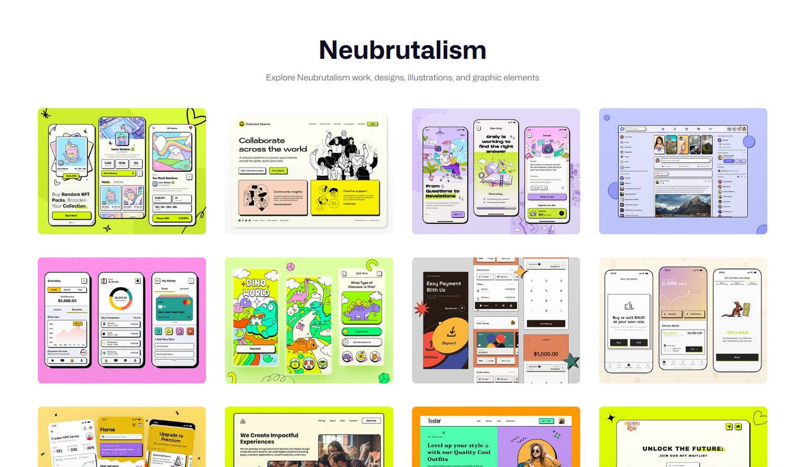

 <small class="block text-center"> Searching for neo-brutalism keywords shows popular visual design works </small>

## Neo-Brutalism

Neo-Brutalism: Also written as Neu-Brutalism or New Brutalism.

The rise of the internet era has accelerated everything, driving technological innovation, aesthetic evolution, and cultural change. The characteristics of the digital age need no further elaboration. Simply put, the rise of Neo-Brutalism is related to the rebellious spirit of the digital age. Designers and artists drew inspiration from mid-20th century architectural Brutalism, bringing its rugged, raw aesthetics to the modern digital stage in the form of "Neo-Brutalism," challenging current mainstream design culture and pursuing authentic, unprocessed, even "anti-UX" expression.

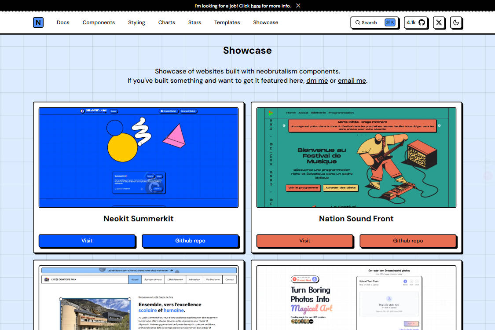

 <small class="block text-center">  <a href="https://www.neobrutalism.dev/" target="_blank">neobrutalism.dev</a> - Open-source component library with Neo-Brutalist style component system</small>

### Neo-Brutalism Style Characteristics

Neo-Brutalism is the modern revival of Brutalism in digital design, especially prominent in web design and UI/UX fields. It inherits architectural Brutalism's "exposed structure" and function-first philosophy, combined with modern technology and digital media characteristics, forming a unique visual and interaction style. Characteristics in web and UI design include:

* Conflicting color schemes: Often uses bright, vivid tones like black-white, red-green-blue color combinations, creating strong visual impact, abandoning soft gradients.
* Thick outlines and heavy shadows: Black outline strokes and shadows seem to inherit the rugged aesthetic of architecture.
* Flat design: Designs often consist of flat elements, illustrations, patterns, and huge text blocks, these elements may bring a sense of chaos.
* Special typography: Typography plays a very important role in Neo-Brutalism, being the element that dominates its visual effect.
* Unique illustrations and animations: Neo-Brutalist illustrations and component design themes are more diverse. Illustration and animation designs are mostly strongly visual styles.
* Function over form: Anti-UX interaction experience, advocating minimalism, inheriting the utilitarian essence of Brutalist architecture.

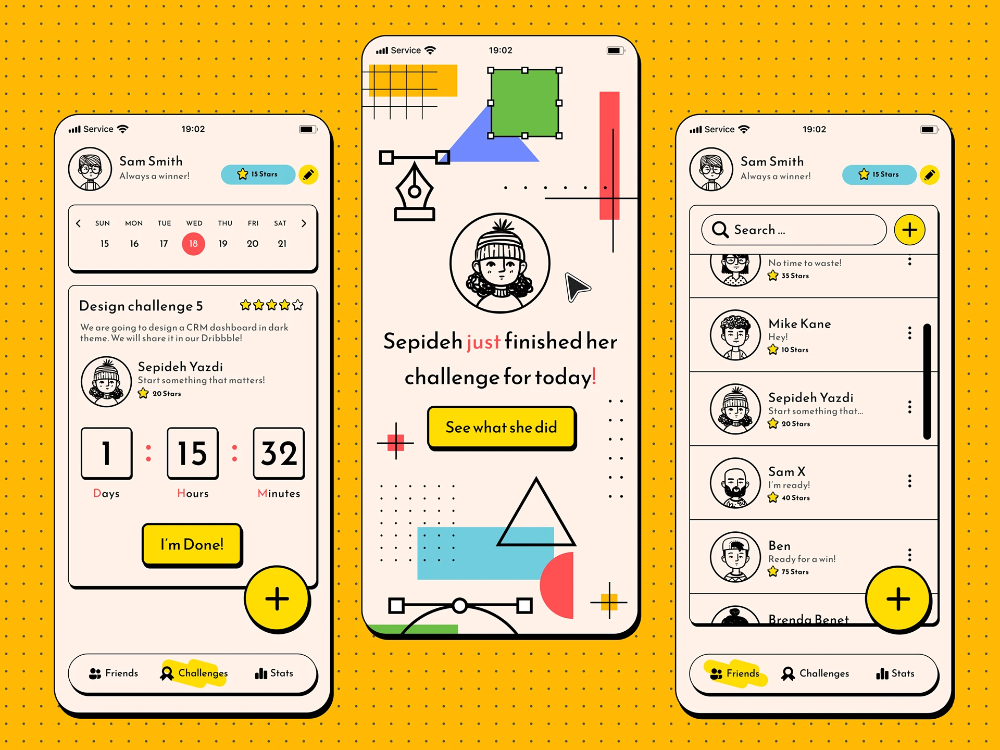

 <small class="block text-center"> Sepideh Yazdi Neo-Brutalist visual style UI design work </small>

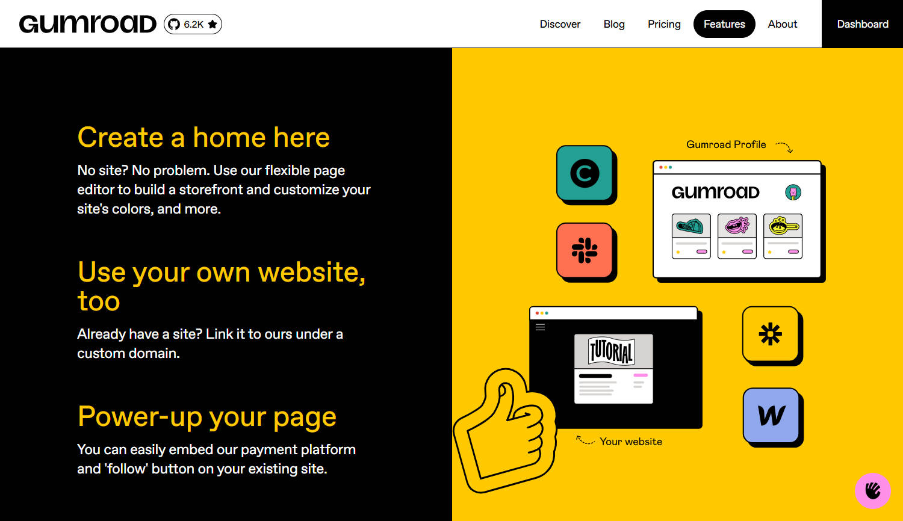

 <small class="block text-center"> <a href="https://gumroad.com/" target="_blank">gumroad</a> design style is also a leader in Neo-Brutalist design </small>

The core of original Brutalism is "no design, no decoration." What makes Neo-Brutalism particularly interesting to me is that it presents a paradox in digital design:

Although it inherits Brutalism's ruggedness and imperfection, in visual presentation, it often demonstrates a prominent "intentional design sense" through deliberate irregularity and strong contrast. The unconventional visual language manifests in results as intentional design sense and strong visual impact, which actually makes Neo-Brutalism increasingly popular and sought after in the digital age - the contradiction between anti-design attitude and design-heavy outcomes.

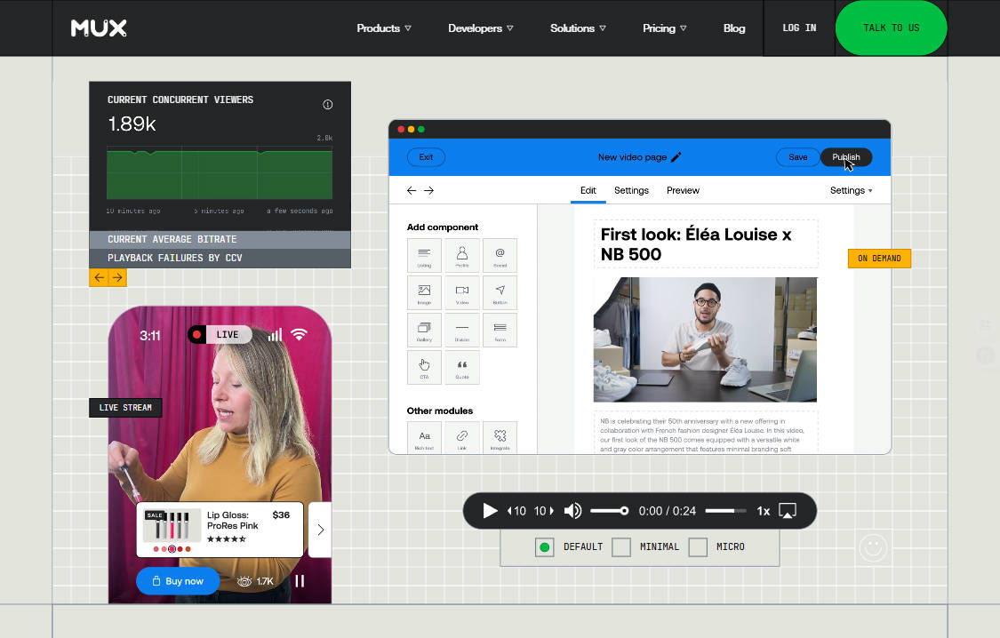

 <small class="block text-center"> The Internet's video API - <a href="https://www.mux.com/" target="_blank">mux.com</a></small>

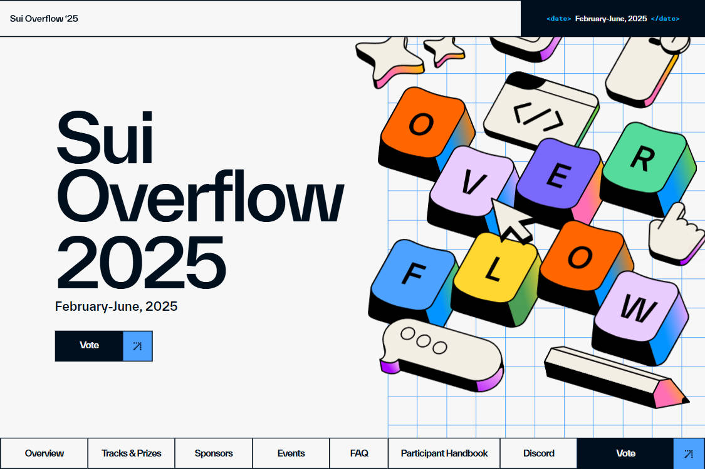
 <small class="block text-center"> <a href="https://sui.io/overflow" target="_blank">sui.io/overflow</a></small>

Neo-Brutalism is commonly used by independent designers, creative agencies, brands, events, fashion and other scenarios, highlighting individuality and anti-mainstream style to attract young users, actually becoming part of mainstream design. Of course, design projects are absolutely complex systems. In fact, we rarely completely classify a project or website into a certain design school. We look at the complete content it expresses from design concepts, logic, and visuals.

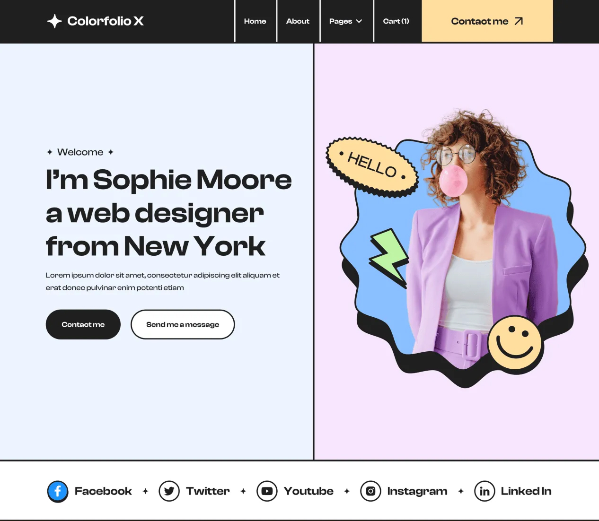

 <small class="block text-center"> Colorfolio X personal portfolio website template </small>

Neo-Brutalism's visual style and philosophy are particularly good choices for brands. Strong visual style and cultural characteristics make users remember the brand deeply and attract like-minded people.

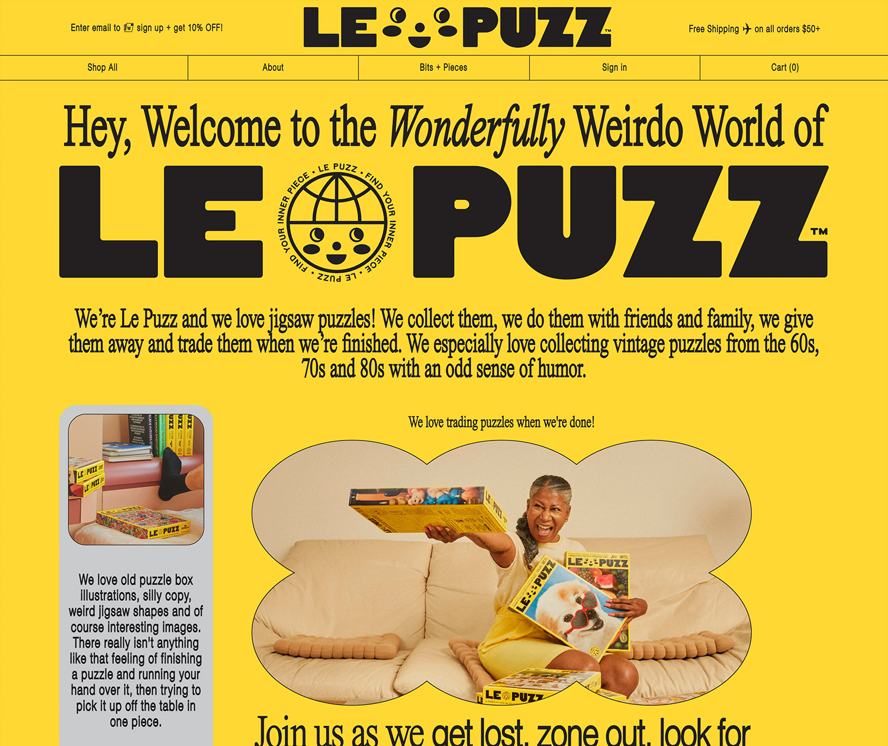

  <small class="block text-center"> Wonderfully weird world Le Puzz - <a href="https://lepuzz.com/" target="_blank">lepuzz.com</a> </small>

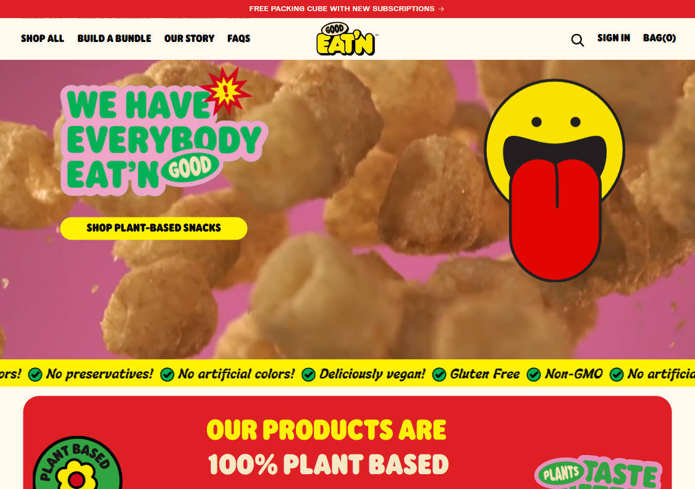

  <small class="block text-center">Plant snack brand - <a href="https://goodeatn.com/" target="_blank">goodeatn.com</a></small>

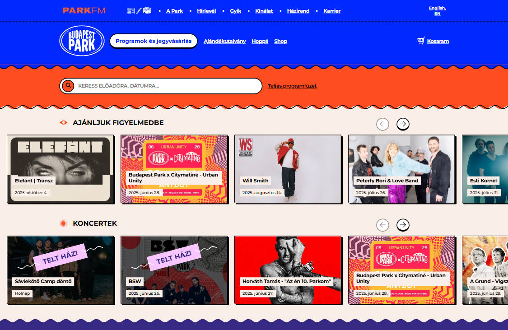

 <small class="block text-center">Budapest Park - <a href="https://www.budapestpark.hu/en" target="_blank">budapestpark.hu</a> </small>

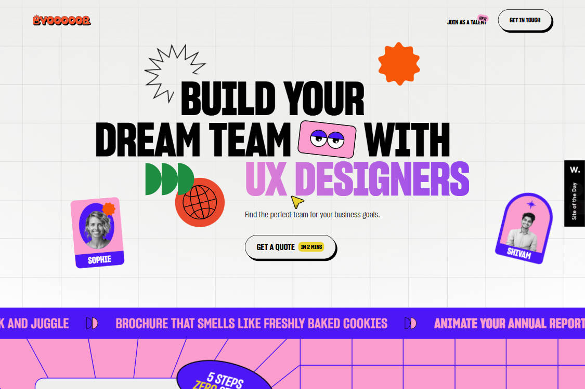

<small class="block text-center"> <a href="https://www.byooooob.com/" target="_blank">byooooob.com</a> </small>

## The Development History of Brutalism

As we know, in design history, the cycle of nostalgia and revival is almost an eternal theme. Each era's design trends are re-examined and honored at some point in the future. We talked about Brutalism born in the mid-20th century - its unique philosophy was considered revolutionary at the time because it challenged traditional aesthetics, attempting to respond to social needs in an honest and direct way.

However, Brutalism was not "popular" from the beginning. It had some influence in the mid-20th century (especially in public buildings like schools, libraries, government buildings), but was also heavily criticized for its "cold," "oppressive" and unadorned appearance.

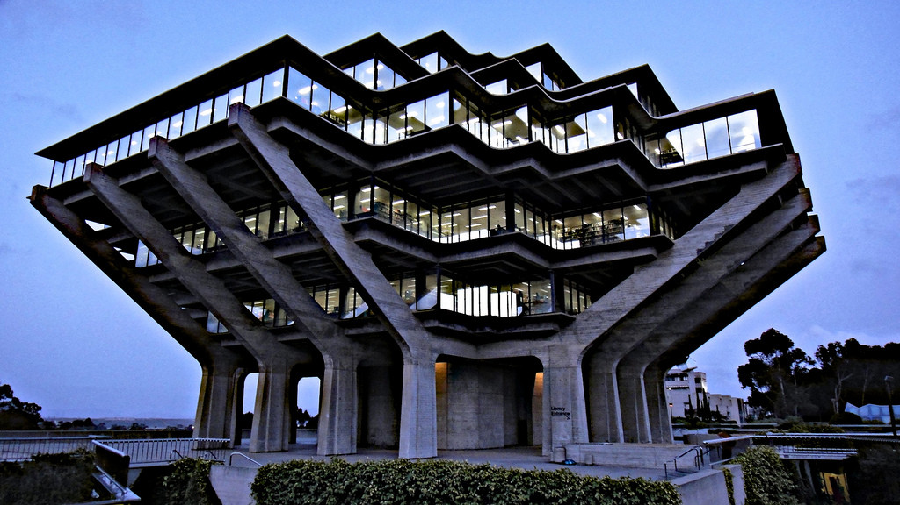
<small class="block text-center"> Geisel Library </small>

*Geisel Library* is a landmark building designed by William Leonard Pereira in the late 1960s, a striking example of Brutalist architecture.

Historically, its development has been up and down:

* Mid-20th century (1950s-1970s): Brutalism emerged in the context of post-war reconstruction, mainly used for public buildings in Europe and North America (such as schools, government buildings), symbolizing modernism's pursuit of functionality and social equality. Its "cold" and unadorned appearance was both revolutionary and controversial.

* Late 20th century (1980s-early 2000s): With the rise of Postmodernism, Brutalism was criticized for its monotony and lack of humanized design, many buildings were abandoned or renovated, gradually marginalized.

* 21st century (2010s to present): With nostalgic sentiment and re-examination of modernism, Brutalism has gradually revived, especially in digital design and visual art fields, evolving into "Neo-Brutalism." This revival is not a simple reproduction, but combines modern aesthetics with anti-mainstream cultural demands.

Therefore, Brutalism's ups and downs reflect changes in design trends and social values. The advent of the digital age provided a broader stage for Neo-Brutalism. Designers reinterpreted its rugged aesthetics through graphic, web and UI design, transforming it from cold, raw architectural language into personality-filled visual expression.

## The Future of Neo-Brutalism

As digital design continues to evolve, Neo-Brutalism may further integrate into mainstream design language, becoming a more widely applied style. Especially as it merges with other retro styles or emerging trends, creating more diversified design possibilities, such as Cyber Brutalism, Postmodern Brutalism, etc. This is actually easy to understand - the rebellious spirit and rugged aesthetics of Brutalism have their soil in every era. "The more advanced, the more primitive." Highly digitized, fast-paced society instead stimulates desire for imperfection and authenticity.

### Cyber Brutalism

The emergence of Cyber Brutalism stems from the digital age's enthusiasm for Cyberpunk culture, and Neo-Brutalism's emphasis on "unfinished feeling" and "exposed structure." Cyberpunk culture's depiction of future technology and social alienation resonates with Neo-Brutalism's rugged aesthetics, especially in design demands for emerging technology fields like virtual reality (VR), augmented reality (AR) and Metaverse. Designers hope to create a visual language that is both futuristic and primitively rugged by combining the two.

It can be felt in films and games, such as the "Blade Runner" film series and the game "Cyberpunk 2077."

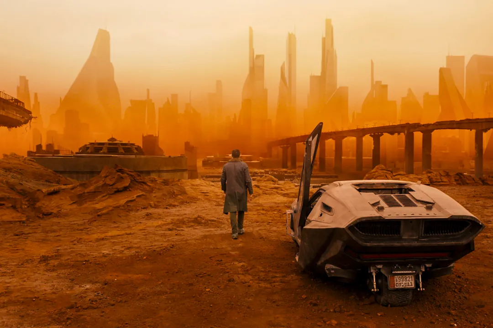

<small class="block text-center"> "Blade Runner 2049" </small>

### Industrial Brutalism

Strictly speaking, this is not a widely recognized or formally named design school. Brutalism itself already emphasized "function first" and "material authenticity" in the 1950s-70s, while industrial style further strengthened this utilitarian aesthetic in contemporary interior design and product design. Therefore, "Industrial Brutalism" can be seen as the convergence of Brutalism's original philosophy with modern industrial style popular trends.

Especially in recent years, industrial style has become popular in interior design (such as loft apartments, cafes) and product design (such as vintage mechanical equipment).

In visual culture, manifestations of this style can be traced back to last century's science fiction films, such as: "Alien" (1979) series, "The Terminator" (1984) series, etc. The films' depictions of future worlds, and mechanical world visions, combined with cold metallic texture and decaying industrial scenes, also reflect Industrial Brutalism's visual language. Of course, the films' aesthetic style itself is complex and diverse, cannot be simply classified, but from their aesthetics and visual language, corresponding elements and expressions can be found.

### Final Words

Looking back at last century's sci-fi films, due to computer effects level limitations, most visual effects were made using real materials. Compared to today's CG images, this highlights a raw, authentic texture.

While these aren't strictly Brutalist works, they all embody some of Brutalism's core philosophies to some extent. These works' visual language connection with Brutalism is more reflected in design philosophy and aesthetic pursuit rather than direct style imitation. Their influence is more reflected in inspiring designers to explore similar visual language, which is connected to Brutalism's spirit of pursuing authenticity and functionality.

### Preview

In the next chapter, I'm still choosing topics, might want to talk about Retro-futurism or Cyberpunk-related styles, and need to think about how to write them properly.

Retro-futurism philosophy is very interesting, "looking at the future from the past and looking at the past from the future," whether in philosophy or visual style, it's an interesting and philosophically deep design trend.

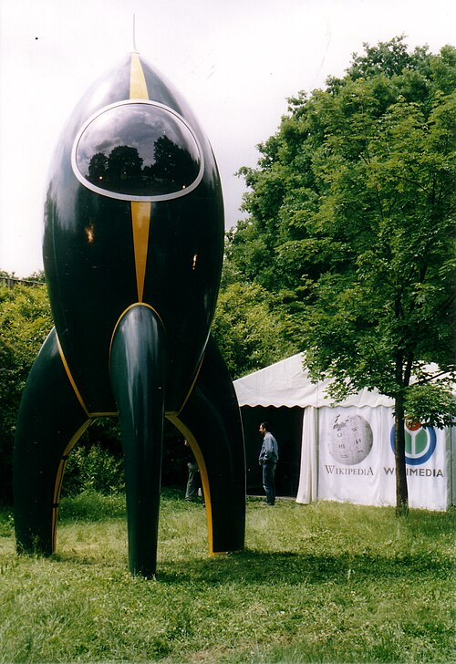

For example, the upcoming "Fantastic Four: First Steps" has a background story set in a retro-futuristic world inspired by the 1960s. Looking forward to a retro-futuristic visual feast.

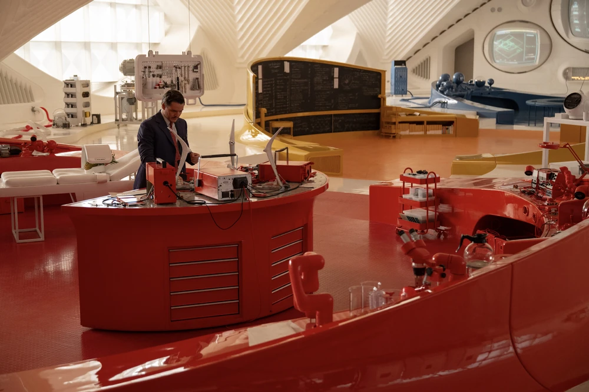
