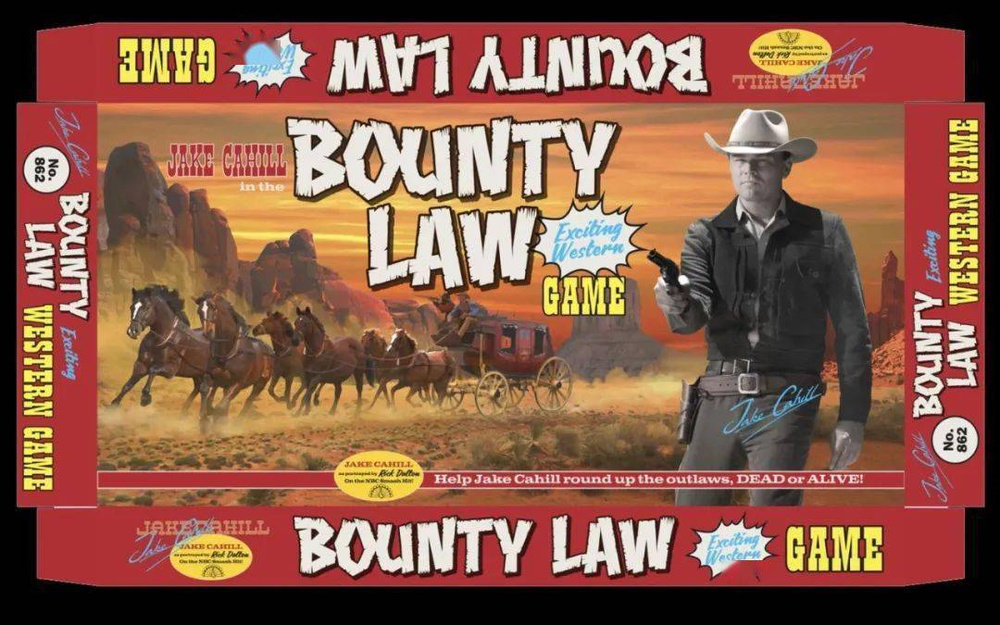
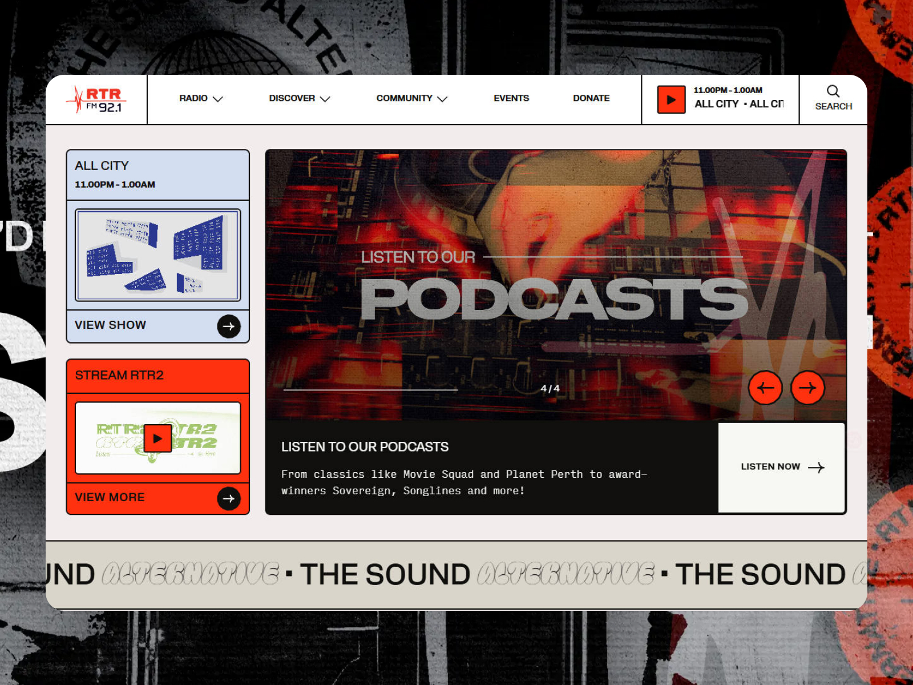
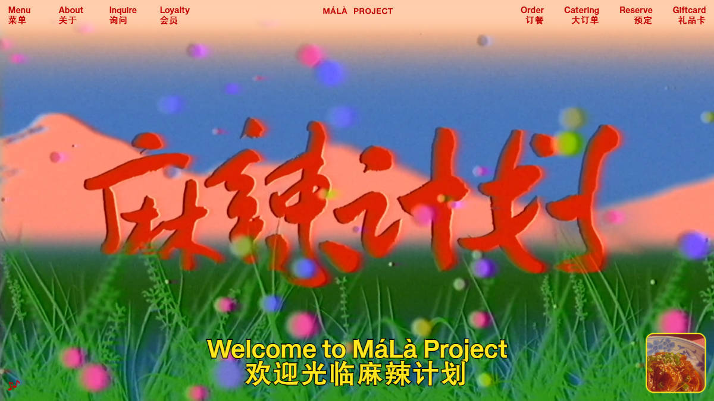
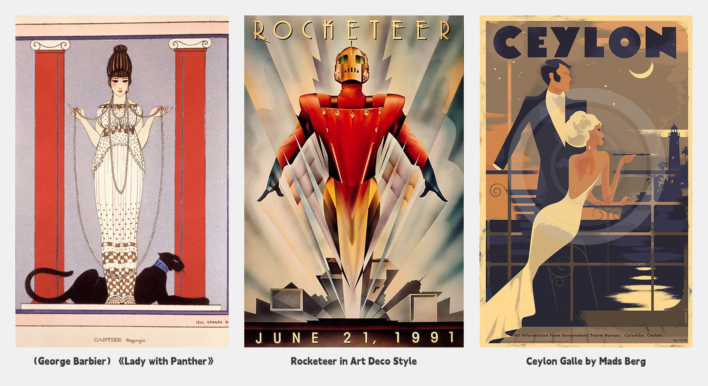
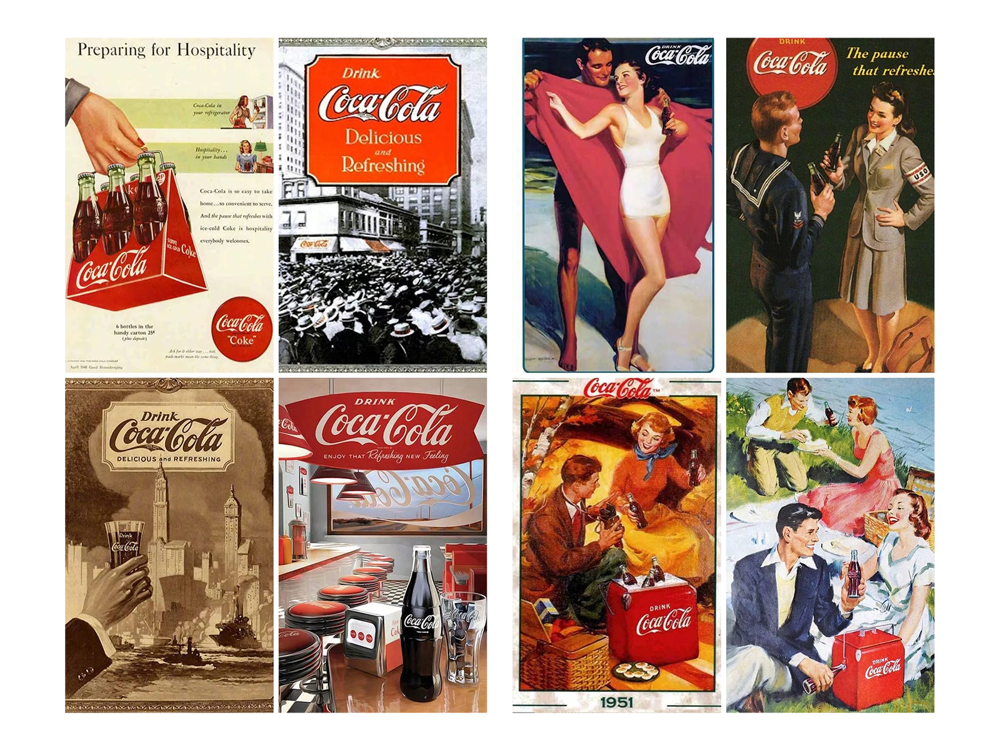
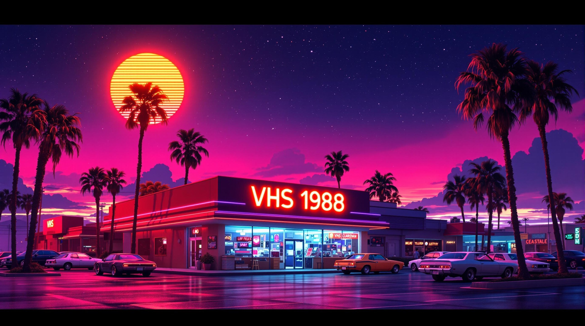
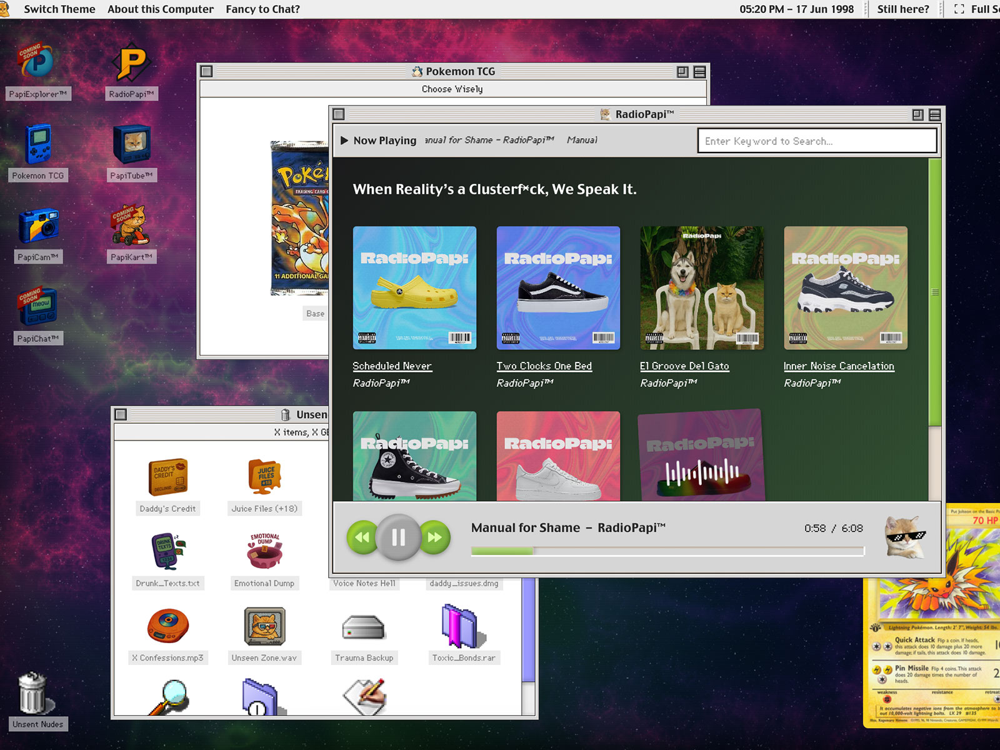
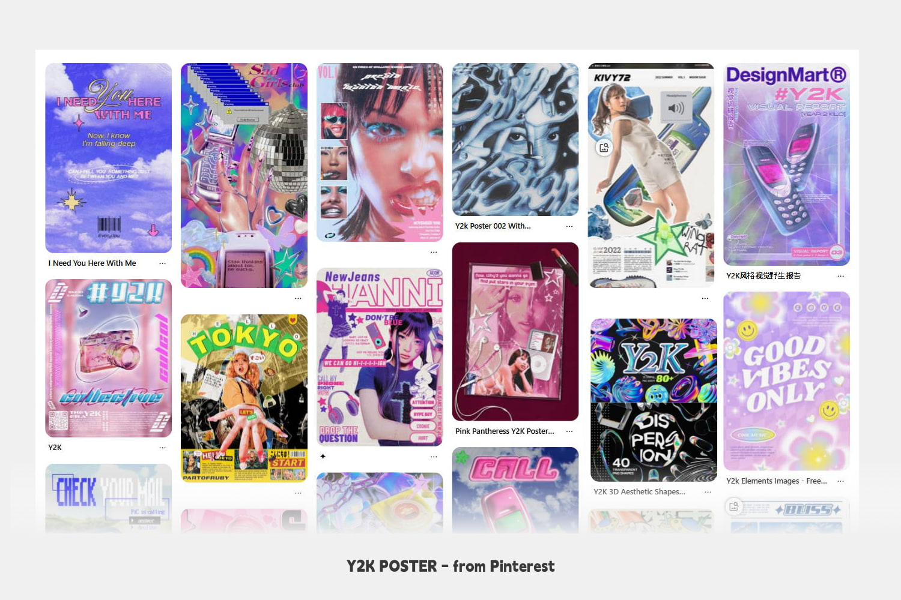
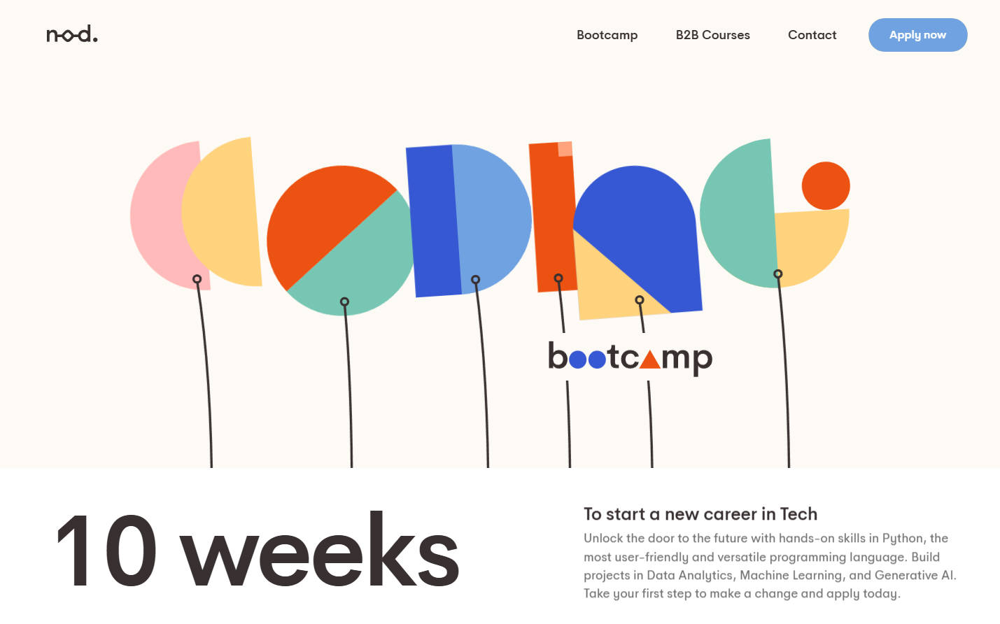
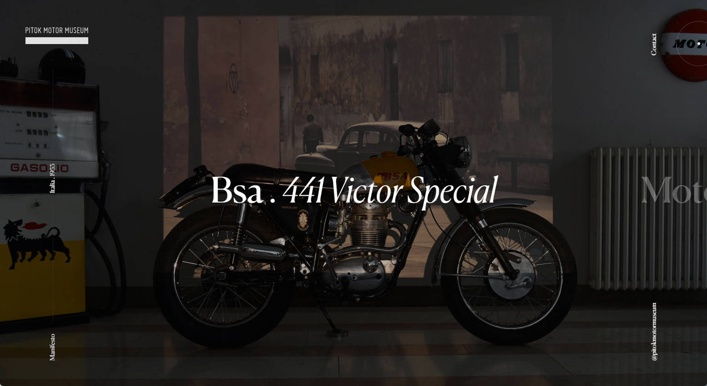

Hello everyone, I'm Rico. Before continuing our journey through design styles, we need to first understand Retroism.

Time moves forward, yet people can't help but reminisce about the past - design trends are no exception. This is a universal phenomenon in human culture and psychology: nostalgia. No matter how society progresses or technology innovates, people often find emotional comfort, identity, or cultural roots by looking back at the past.

In the design field, this phenomenon is particularly evident, because design is not only an embodiment of function, but also a carrier of culture, emotion, and zeitgeist - progress and nostalgia coexist. In design history, the cycle of nostalgia and revival is almost an eternal theme. Each era's design trends are re-examined and honored at some future moment.

<small class="block text-center"> "Once Upon a Time in Hollywood" poster </small>

<small class="block text-center"> <a href="https://seasoned.koto.studio/" target="_blank">Seasoned brand design studio - seasoned.koto.studio</a> </small>

**Retro design is a design style that evokes nostalgia by borrowing visual elements, colors, typography, and overall atmosphere from specific past eras. It centers on retrospection and tribute to history, typically creating familiarity and emotional resonance by recreating the aesthetic characteristics of a certain era.**

When we talk about retro design, it can refer both to a specific style and to an overall concept. Retro design is not a single form, but a broad design category. It can point to different eras, such as the Art Deco style of the 1920s, the Psychedelic Style of the 70s, or the Neon Style of the 80s. It can be said that retro design encompasses all historical content on the past timeline, and in different geographical locations and cultural backgrounds, it presents even more diverse appearances.

<small class="block text-center"> <a href="https://rtrfm.com.au/" target="_blank">RTRFM - The Sound Alternative</a> </small>

<small class="block text-center"> <a href="https://malaproject.com/" target="_blank">Retro restaurant website - MaLaProject</a> </small>

So what does retro design style look like? Let's take a brief look at some representative retro designs:

### 1. 1920s-30s: Art Deco

This was an era full of luxury, modernity, and geometric beauty. Art Deco merged the mechanical aesthetics of the late Industrial Revolution with the simple lines of early modernism, emphasizing symmetry, streamlined design, and luxurious decorative details. It features geometric shapes, fan decorations, stepped compositions, and materials like metal, marble, and ivory, with bold color combinations of gold, black, silver, and emerald green.

This style remains popular in contemporary high-end brand design, such as luxury packaging, wedding invitations, or high-end event invitations. Its refinement and symmetry give designs a solemn and elegant temperament.

### 2. 1950s: Nostalgic Advertising Style

(Vintage & Retro Advertising) If the 20s-30s were synonymous with luxury and modernity, then the 50s were symbols of warmth and hope. Post-war economic recovery filled people's lives with vitality and optimism, and design styles reflected this social atmosphere. 50s design features hand-drawn illustrations, soft tones (like pink, light blue, cream yellow), and rounded fonts, commonly seen in food packaging, restaurant menus, and advertising posters.

Design from this period is full of family atmosphere, with a sense of intimacy and human touch. Retro posters, classic car advertisements, and neon signs all convey a relaxed and pleasant lifestyle. Today, this style is often used by brands hoping to convey "classic" or "traditional" values.

### 3. 1970s: Hippie and Psychedelic Style

(Psychedelic Art)

The 70s were a rebellious and free era, a spirit manifested in design through bold colors, psychedelic patterns, and exaggerated fonts. Psychedelic style design is often full of visual impact, with gradients and lighting effects making images appear dreamlike and unreal.

This style's design is commonly seen in music album covers, posters, and trendy art works, representing the 70s younger generation's pursuit of freedom and individuality. Today, psychedelic style is widely applied to music festival visual design, trendy apparel, and brand images related to youth culture - its bold, unrestrained character remains an important inspiration source for many designers.

### 4. 1980s: Neon and Futurism

(Neon Retro Futurism)

The 80s were the intersection of technology and pop culture. This era's design is marked by bright neon colors, geometric shapes, and digitized futurism. Neon signs, CRT monitor scan line effects, and grid backgrounds became classic 80s design symbols.

This style was widely used in music videos, video game covers, and movie posters (like "Blade Runner") at the time, becoming a symbol of 80s pop culture. Today, this style has been rediscovered and applied to tech website design, video game UI, trendy apparel brands, and sci-fi film visuals, both evoking the past and inspiring imagination about the future.

<small class="block text-center"> <a href="https://loox.app/lost-in-space" target="_blank">loox.app/lost-in-space</a> </small>

<small class="block text-center"> <a href="https://sunsetrace.ginrin.com/" target="_blank">sunsetrace.ginrin.com</a> </small>

<small class="block text-center"> <a href="https://www.instagram.com/thelostvibe0/" target="_blank">Fluorescent nights and faded memories</a> </small>

### 5. 1990s: Retro Tech

(Retro Tech / Y2K aesthetic)

The 90s were the internet's infancy, with design full of early tech symbols like pixel style, low-resolution images, and simple interfaces. The classic Windows 95 interface and early webpage layouts became representative of this period.

<small class="block text-center"> <a href="https://www.radiopapi.fm/" target="_blank">RadioPapi FM website's retro design</a> </small>

This style also spawned the "Y2K" (**Year 2000 Kilo**) design language, combining futuristic tech sense with the rough aesthetics of the internet's early days, commonly seen in graphic design, web design, and game UI. Today, Y2K style has been rediscovered and applied to trendy brands, electronic music album covers, and youthful digital product design, evoking nostalgia for the internet's early days.

Besides these era-specific retro styles, some regional styles also occupy important positions in retro design.

For example, Bauhaus style originated in early 20th century Germany and is one of the founders of modern design. Bauhaus emphasizes simplicity and functionality, using geometric shapes, basic colors, and sans-serif fonts extensively in design, becoming an inspiration source for minimalist design.

<small class="block text-center"> <a href="https://nodcoding.com/" target="_blank">Bauhaus style - nodcoding.com</a> </small>

<small class="block text-center"> <a href="https://nikebauhaus.vercel.app/" target="_blank">Nike x The Bauhaus </a> </small>

### Showa Retro (昭和レトロ/Showa Retro)

Japanese retro style displays unique Eastern charm, such as Showa Retro, which merges Japanese and Western elements with bright colors and nostalgic atmosphere. The design color scheme tends toward strong, deep, rich colors, creating intense visual impact and special Eastern cultural charm.

<small class="block text-center"> "Showa 40 Year Man" magazine cover</small>

### Distinguishing Vintage and Retro

When describing retroism, we often use Vintage and Retro, which refer to different concepts.

- **Vintage**

Refers to items or designs that genuinely come from a past era, usually with certain historical value and collectible significance, emphasizing authenticity, directly from a past era, possibly bearing marks of time. Vintage is typically used to describe actual old items (like antique furniture, old clothes, old records) or design styles. For example, an original 1950s poster.

<small class="block text-center"> <a href="http://pitokmm.it/" target="_blank">Pitok Motor Museum </a> </small>

- **Retro** refers to imitating or borrowing design styles from a past era, but not genuinely from that era - rather modern re-creation. Although inspired by history, the work itself is modern, emphasizing tribute and recreation of past styles, but usually incorporating modern elements, adapting to contemporary aesthetics and functional needs.

Simply put, Vintage is "genuine old items," while Retro is "modern retro design."

### **Summary**

Retro design style is a design method that evokes nostalgia by recreating aesthetic characteristics of specific past eras. It's widely applied in graphic design, UI design, and web design, with different era retro styles each having unique features. Its greatest charm lies in its ability to touch people's nostalgic emotions by recreating past aesthetic symbols, evoking emotional resonance through reminiscing about the past, while giving design more spiritual value.

Understanding retroism, we know that every coordinate point on the past timeline, due to its specific era culture and historical characteristics, produced specific era styles. And nostalgic sentiment mixes and combines past era styles with the present, deriving more interesting design works - this is what we want to focus on exploring in the future. These products merging different eras, cultures, designs, and other diverse achievements are so magical. Hope to enjoy this journey exploring design styles together with everyone.
