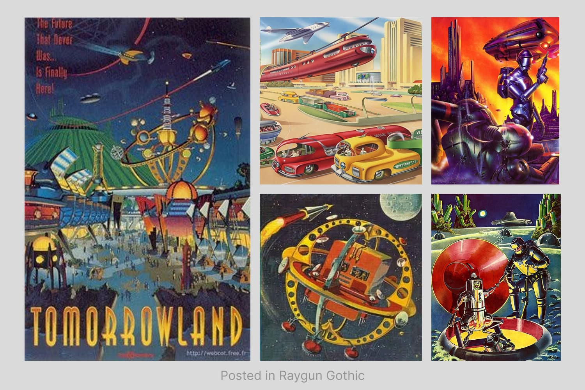
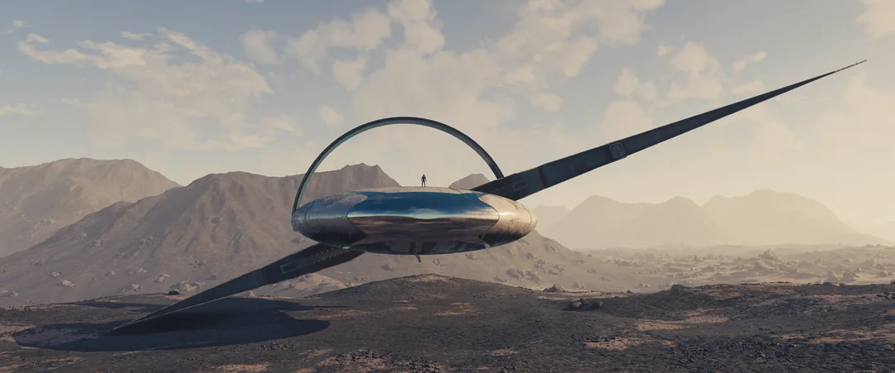
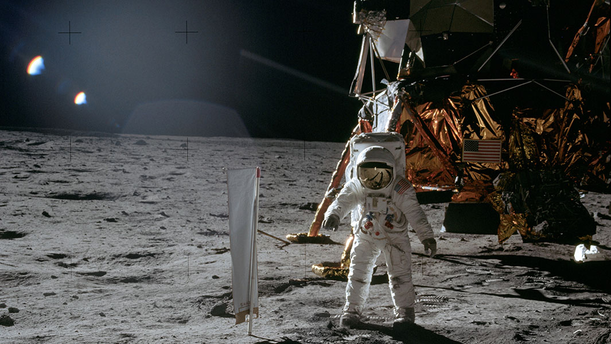
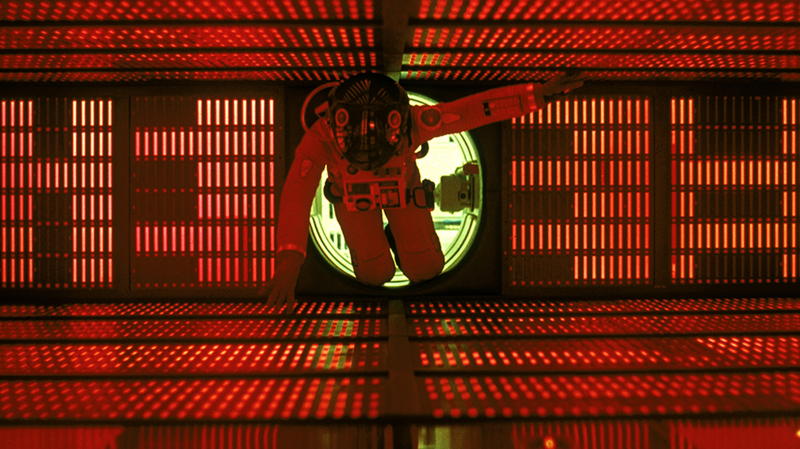
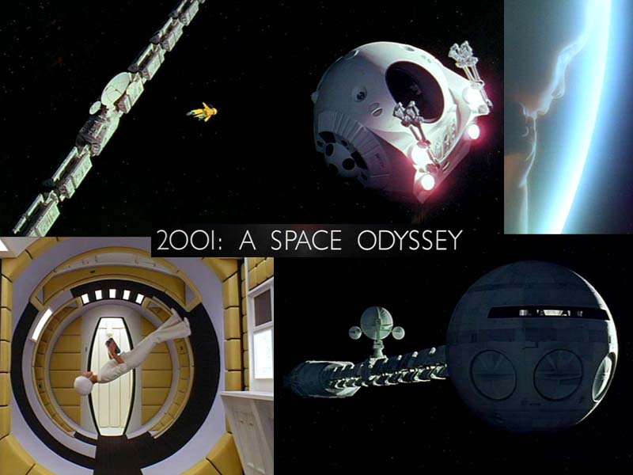
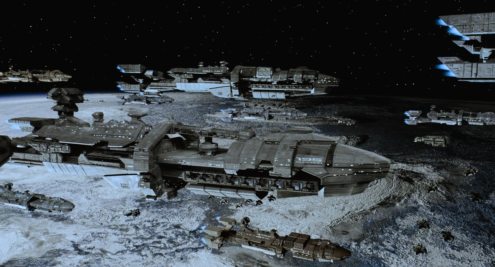
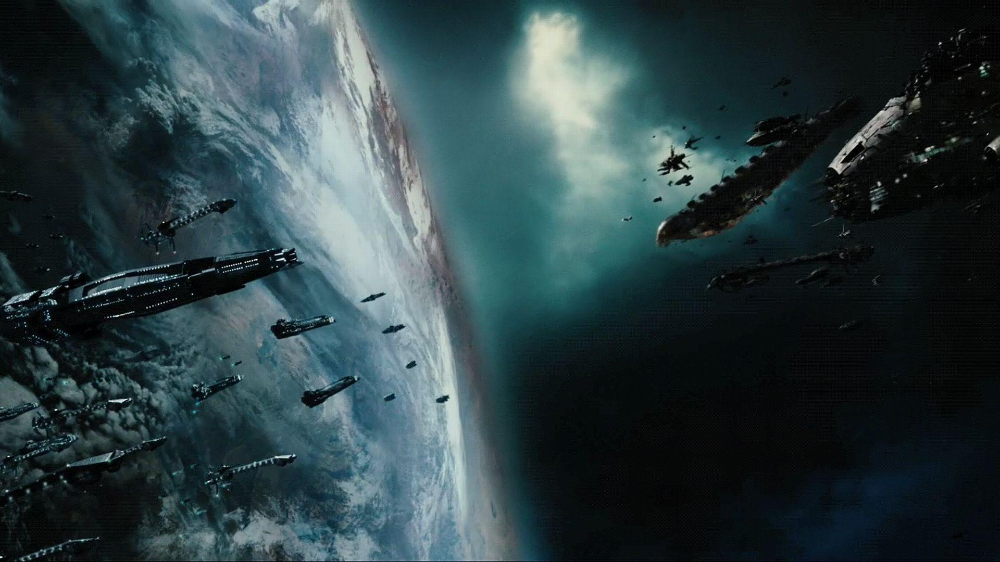
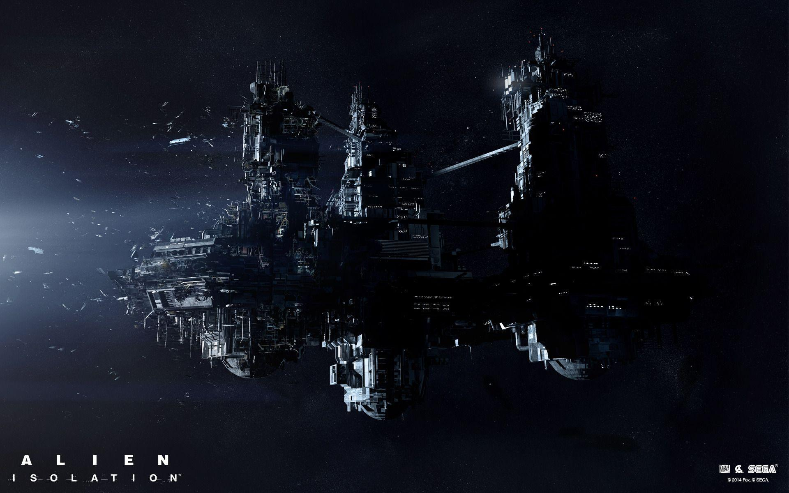
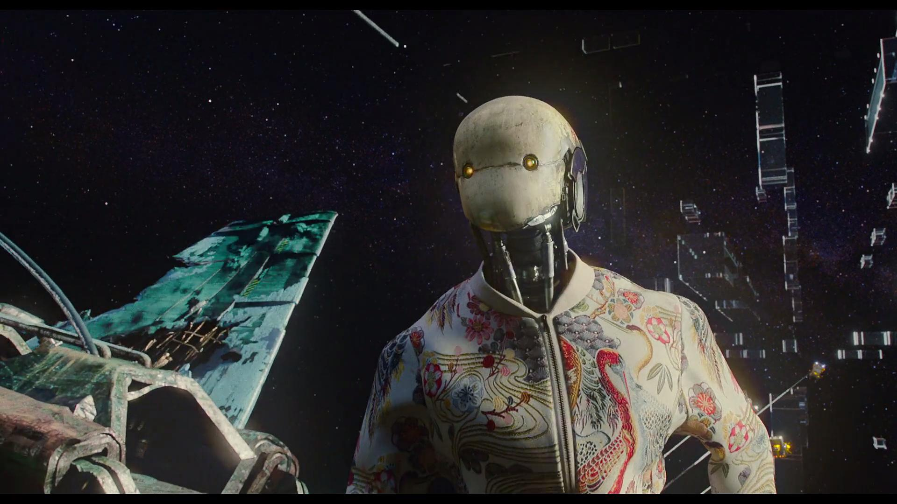
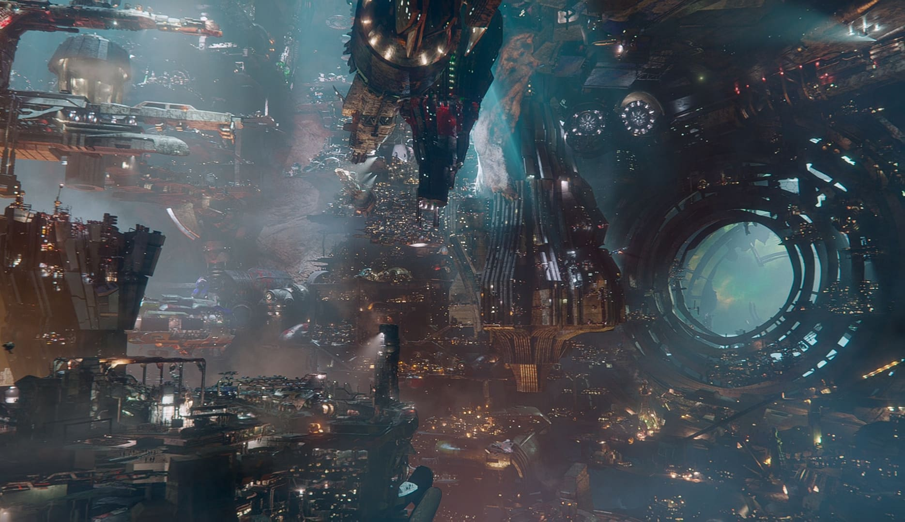

I'm Rico, welcome to Punk aesthetics.

The spiritual core of Punk is **rebellion and deconstruction**. Beyond the familiar Cyberpunk and Steampunk, there's also Spacepunk, Classic Punk, Post-Apocalyptic Punk, Dieselpunk, Atompunk, Biopunk, and more. Almost any word can combine with "Punk" to derive a unique aesthetic style.

Let's first discuss the relatively niche Spacepunk.

Definition - Punk, cited from Wikipedia:

> Punk culture is a subculture that originated in Britain in the 1970s, initially expressed through minimalist rock music, later developing into a comprehensive cultural movement integrating music, fashion, and ideology. Its core spirit includes rebelliousness, subversiveness, and anarchism, often expressing protest against social injustice through raw melodies, straightforward lyrics, and anti-traditional fashion.

## Spacepunk and NASA-Punk

"Spacepunk" is a style combining space sci-fi themes with the "Punk" spirit, merging punk's rebellious, anti-establishment themes with the futuristic aesthetics and technology of space exploration. It typically features retro-futuristic style, drawing inspiration from the space race era, exploring themes of technological advancement, cosmic adventure, and social rebellion in space settings.

<small class="block text-center"> Raygun Gothic illustration - With exaggerated lines and bold imagination, depicting extremely futuristic space scenes, is the prototype of early Spacepunk visuals.</small>

Although the term "Space Punk" has no exact proposal time, its prototype can be traced back to the 1979 film "Alien," and gradually became popular and widely recognized as an independent style label after the 2002 TV series "Firefly" aired. The "Guardians of the Galaxy" series also carries some "punk" characteristics.

Additionally, Bethesda Game Studios explicitly proposed the concept of "NASA-Punk" during the development of "Starfield" (2023 game), defining the game's art style. The art team mentioned that "NASA Punk" inspiration comes from NASA spacecraft design and human space history, aiming to create a retro-futuristic feel based on realistic technology.

<small class="block text-center"> "Starfield" game screenshot - Self-positioned as "NASA Punk" aesthetic - by reddit </small>

But actually, there's a difference between the two. Spacepunk inherits punk culture's rebellious and dystopian spirit, focusing on marginalized groups' struggles; NASA Punk embodies optimistic exploration spirit, a retro-futurism based on existing aerospace technology, with weaker critical intensity than typical Spacepunk.

## Historical Context

### I. 1960–1970: Emergence Under the Space Race

In the 1960s, the space race was in full swing. Humanity was filled with infinite optimism and longing for space. The development of aerospace technology provided possibilities for exploring extraterrestrial worlds. Spacepunk began to emerge in this context, presenting a highly idealized techno-romantic style.

<small class="block text-center"> Apollo 11 moon landing</small>

Works from this period are more like the "spiritual predecessor of Spacepunk" — they cultivated the visual foundation of "space exploration" but hadn't yet integrated "punk's rebellious core." The design style manifested as **highly idealized techno-romanticism**.

In design style, during this period, spacecraft mostly adopted sleek streamlined designs, abandoning redundant decoration to pursue resistance-free travel between stars, highlighting extreme pursuit of speed and efficiency. Colors were dominated by bright metallic tones, paired with orange, creating a visually hopeful atmosphere. Details emphasized technology's precision, such as bubble helmet's transparent material, neat cable layouts on spacesuits, demonstrating trust in technical perfection while incorporating imagination of commercialization elements.

<small class="block text-center">"2001: A Space Odyssey" 1968</small>

This stage, driven by the space race, presented idealized, romanticized characteristics, integrating humanity's infinite longing for space into design - a perfect fusion of technology and dreams.

<small class="block text-center"> "2001: A Space Odyssey" 1968 - Its bold innovation and visual approach influenced subsequent sci-fi and space films, widely recognized as a milestone in film history.</small>

### II. 1980–1990: Development After Cold War Cooling

As the Cold War cooled, the space race's heat gradually subsided, and humanity's fantasies about space gained more realistic coldness. Spacepunk aesthetics entered a "ruins" phase, with visual elements beginning to show decay and weathering. Works from this period began to have a "dystopian" undertone, with some cases' "roughness" and "questioning of authority" approaching Spacepunk.

Spacecraft were no longer perfectly streamlined, but bore real traces of wear and tear - damaged, mottled components, rusted, peeling metal shells telling of space environment's harshness and spacecraft's wear. Colors leaned toward gray, faded tones, lacking the 60s' brightness and vitality, adding depression and heaviness, making space no longer distant but full of real-life texture. This reflects society's diminished enthusiasm for space exploration post-reality mindset, and concerns about technical limitations and resource depletion.

Works from this period had more life atmosphere and loneliness, manifesting as **combination of industrial realism and decay aesthetics**.

<small class="block text-center"> "Starship Troopers" (1997) - Though not pure Spacepunk, provides system critique perspective through militarism extremism, I believe it also has some Spacepunk visual experience and characteristics.</small>

<small class="block text-center"> "Serenity"</small>

After Cold War cooling, Spacepunk shed utopian glory, presenting in a more realistic, colder posture. Decayed visual elements and integrated life scenes fully display space exploration's hardship and loneliness - a realistic return to space fantasy.

### III. To Present: Digital Ruins and Retro Future

Entering the 21st century to present, digital technology development and technological progress have brought new characteristics to cognition and assumptions about space and the future. Compared to previous styles, digital information, new crafts, and technological humanistic concepts have become new cores. Combined with nostalgic sentiment for last century's aerospace era, from a broad concept, it's easier to associate with **Retro-Futurism** we previously mentioned.

Works from this period need to simultaneously satisfy "digital and retro mashup" and "questioning current order," avoiding simply equating "space theme + retro elements" with Spacepunk.

**Design style from this period manifests as collision and fusion of digital technology and retro industry.**

Modular design and information technology became mainstream. Spacecraft design better fits contemporary technical thought and emphasis on information technology, containing more fantastical future tech sense under nostalgic machine exteriors. In colors, while retaining classic tones like titanium white and aerospace orange, retro filter effects are added, imitating last century's image effects, giving images retro grain and haziness.

<small class="block text-center">"Starfield" game 2023 - Proposed "NASA Punk" as the game's art style</small>

Material use is more diverse. Design emphasizes "honest industrial style," combining some Brutalist concepts, clearly presenting spacecraft structure and history to people. Meanwhile, digital ruin elements often appear, such as retro industrial products coexisting with advanced digital technology, creating a unique temporal dislocation atmosphere. From modern works, it's more diversified.

<small class="block text-center">"Alien Isolation" game image</small>

<small class="block text-center">"Guardians of the Galaxy" "Space Sweepers" 2021 - Set in 2092, "Victory" is a spaceship specializing in cleaning space debris, crew members are lower-class groups making a living in space. With space as background, focusing on lower-class marginal characters' survival, conforms to Spacepunk's emphasis on lower-class narrative.</small>

<small class="block text-center">"Guardians of the Galaxy" screenshot - Although more "retro pop culture collage + lower-class resistance + anti-authority," it also possesses Spacepunk thought core.</small>

## Summary

This chapter's case selection made me hesitant. On one hand, it's niche, lacking overly distinct works that can fully express "Spacepunk = visual style + rebellious spirit + space narrative" trinity characteristics. On the other hand, it's hard to show its core spirit from single static visuals alone.

Though Spacepunk belongs to punk style branches like Cyberpunk and Steampunk, each has unique characteristics. "Space background" is just Spacepunk's carrier. Its core is the combination of punk spirit and space setting, attempting to deconstruct "space exploration's" romantic imagination through rebellious narrative, rough aesthetics, and lower-class perspective.

Modern Spacepunk is more diversified, not just simply "space theme + retro elements," but through these visual and narrative elements, raising profound questions about contemporary technological development, social structure, and human future, while maintaining nostalgic sentiment for space exploration history.

I'm Rico, thanks for reading!
