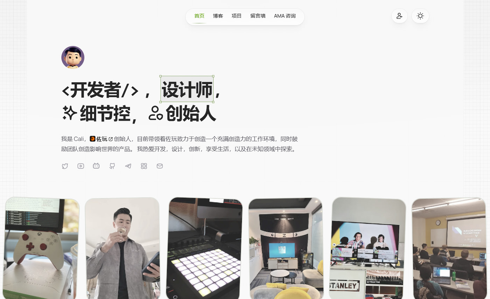
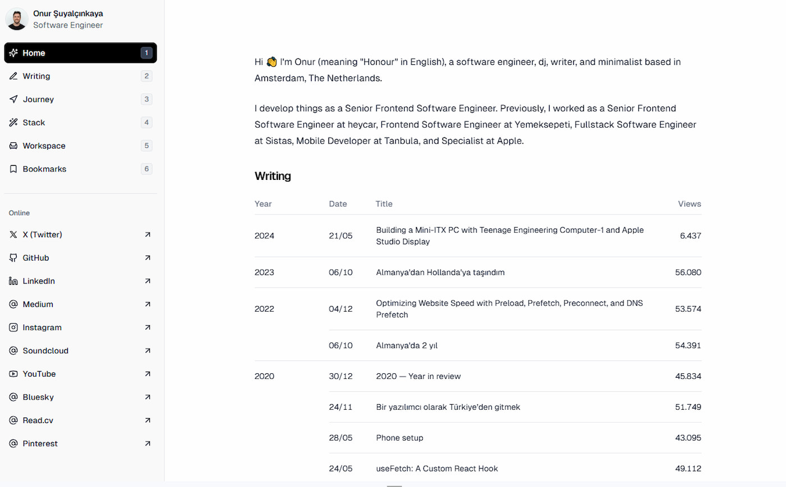
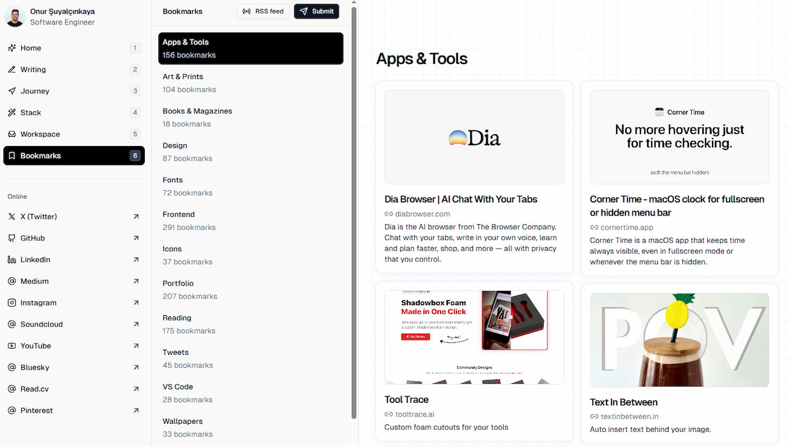
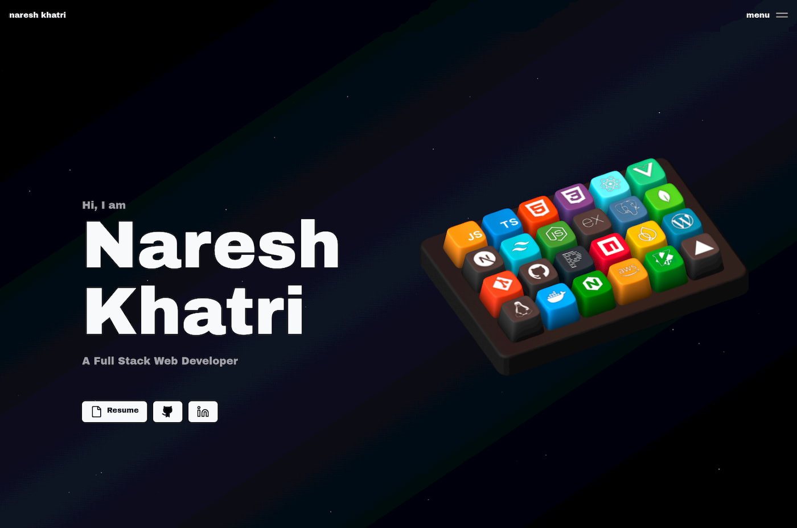
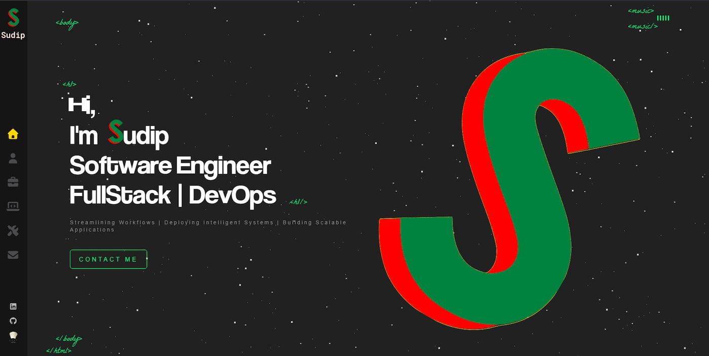
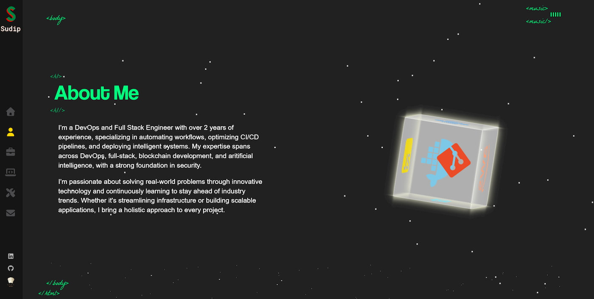
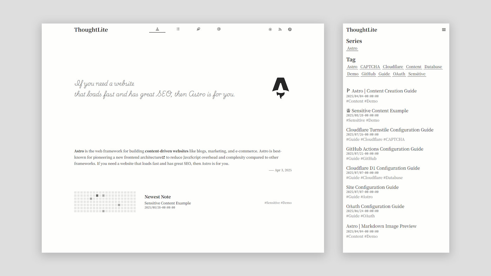
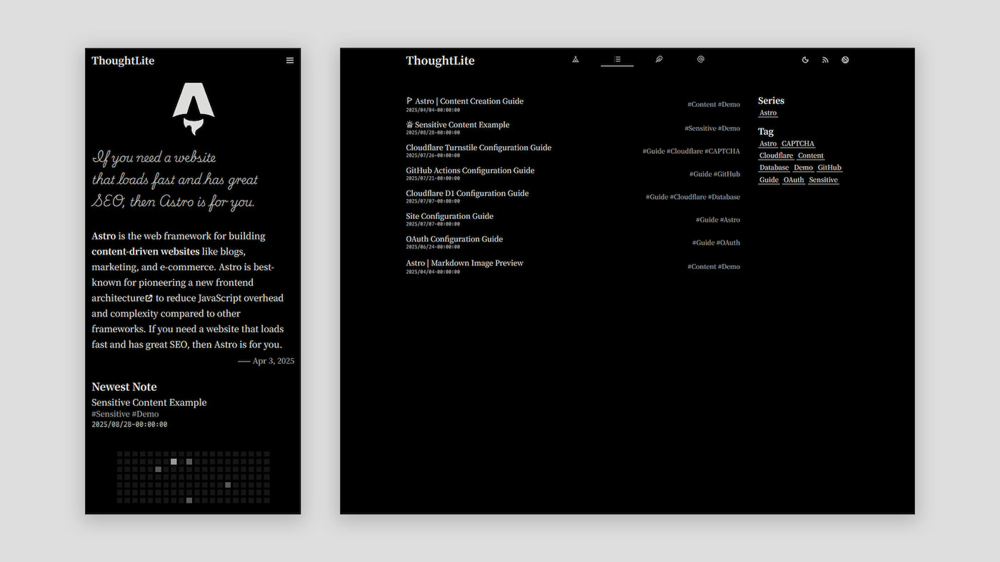

## AI Coding and Personal Websites

With the popularity of AI coding, the development threshold has genuinely lowered. Discussions about personal websites have gained more attention recently, with many articles teaching how to use AI to create personal websites and blogs. However, most final products are too rough, merely setting up a static webpage framework, lacking functionality and performance considerations.

So what qualities should a complete and quality personal website or blog possess? After all, for designers, a personal website is not just "a place to put work," but also a showcase of their design ability and aesthetic vision. For beginners learning development, building a personal website is the best practical scenario for understanding frontend logic and familiarizing with development workflow.

Today let's discuss some common questions about personal websites - which type of website to choose? How to match technology stack with requirements? How to weigh no-code versus self-deployment, etc. At the end, I'll share carefully selected open-source personal website and blog templates.

## Common Personal Website Types

The core value of personal websites is "matching needs with scenarios" — different identities and goals require completely different website types. Different purposes correspond to different functional and visual needs. Especially for designers, choosing the right type maximizes portfolio display effectiveness. Current mainstream personal websites can be divided into three categories, covering most needs:

**1. Content Sharing (including blogs, technical notes)**

Centered on "conveying information, accumulating knowledge," not limited to pure text. Suitable for copywriters, developers, or industry observers, also includes daily records, mainly text creation. It emphasizes "content readability" and "search convenience."

**Suitable for**

- Developers (sharing technical tutorials, troubleshooting notes);
- Industry observers (outputting design trends, workplace perspectives);
- Copywriters/Creators (daily reflections, short content accumulation).

**2. Portfolio Showcase (Designers/Creators' First Choice)**

Making "work" the absolute protagonist, the goal is "letting visitors intuitively see your professional ability." It's not just "displaying work," but "explaining work value clearly" - the core showcase vehicle for designers, illustrators, and product managers.

**Suitable for**

- Visual/UI/UX designers (showcasing interface design, interaction prototypes);
- Illustrators/Motion designers (high-resolution work collections, creative process);
- Independent developers (personal project demos, product prototypes).

**3. Personal Brand Comprehensive (Integrating all core information)**

Equivalent to a "personal official website," integrating portfolio, blog, personal bio, contact information and other functions, suitable for professionals with clear personal brand positioning (like independent designers, freelance consultants). Its core is shaping a three-dimensional personal image. Functionally, it needs to combine both advantages, while visually maintaining overall style unity, avoiding fragmentation between different modules.

**Suitable for**

- Independent designers/Freelancers (letting clients see work, case experience, service range simultaneously);
- Career advancers (integrating project experience, technical blog, personal honors, for job seeking or cooperation negotiations);
- Multi-field creators (like "designer + photographer," needing to showcase two types of work simultaneously).

## How to Choose Technology Stack

Choosing a technology stack is essentially "need matching." You don't need to master all tools, but need to choose "tools that solve problems and have long-term value." Many people fall into "technology anxiety," but actually for personal websites, small scale, low technical difficulty, belongs to lightweight small projects. Technology error tolerance is very high.

**First clarify your core needs**

Before choosing a technology stack, ask yourself three questions:

- What is your website's core function? (Is it displaying static work, or needing dynamic interaction?)
- Do you need subsequent maintenance and feature iteration? (Need frequent content module updates and modifications)
- Do you want to learn new skills through building a website? (Like designers wanting to understand frontend basics)

For example, if you just want to display a static portfolio, don't need complex interaction, low update frequency, simple HTML+CSS+JS is sufficient. More mature lightweight solutions (like Astro, Hugo) are more suitable. If you want to add complex functions and interactions, you can choose frontend frameworks like React, Vue. Choose according to need, and communicate technology stack solutions with AI.

### **Recommended Technology Stacks: React, Vue, Astro**

For designers and beginners, the core advantages of popular technology stacks are "low learning cost, rich community resources and tutorials, high long-term value."

- **Rich learning resources**: These technology stacks have mature communities. Whether official documentation, Bilibili tutorials, or AI Coding, you can quickly find answers. For example, the most popular UI framework Shadcn/UI has rich templates and theme resources, plus mature AI support.
- **Designer-friendly**: React and Vue's "component-based development" is strongly supported by design tools like Figma. You can use tools to convert design components to code, directly connecting design to code path. Astro focuses on "Static Site Generation (SSG)," achieving both fast static page loading and supporting embedded dynamic components (like interaction modules written in React), balancing "performance" and "flexibility," focusing on implementation.
- **Long-term value**: Designers "understanding basic frontend" helps at work. For example, being able to read HTML/CSS structure, understand interaction implementation logic, master React, Vue and other development basics not only facilitates efficient communication with development teams, but also helps better implement your design ideas.

Besides the recommended technology stacks above, there are also WordPress, Hugo, Ghost, Hexo and other solutions on the market. Their positioning and characteristics differ greatly. Considering article length, you can explore specific details yourself. For designers, I don't particularly recommend them. If readers are pure content creators, they can still be considered.

Simply put, if you want to balance design freedom and learning cost, **Astro** is the optimal solution (static pages load fast, supports embedding React/Vue and other frameworks, low entry threshold). If you want to deeply learn frontend, **React/Vue** has more long-term value. If you completely don't want to touch code and can accept payment, you can use no-code platforms (Framer, Webflow, Figma Site, etc.), but long-term, self-deployed static sites are more worry-free.

## About No-Code Platforms VS Self-Deployment

Currently two mainstream approaches: no-code platforms (Framer, Figma Site, Webflow) and self-deployment, each with pros and cons.

### No-Code Platforms - Require payment, convenient but not free enough

Advantages are obvious: No need to write code, build websites through visual design platforms, and have built-in CMS management systems, convenient for editing content. Especially Figma Site can directly convert Figma design drafts into websites. For designers, low learning cost, suitable for those wanting to quickly build a temporary showcase page.

But there are also disadvantages:

- **Too platform-dependent**: For example, using Framer, sites are completely hosted on the platform, cannot be used apart from the platform. The longer the operation, the higher the migration time and cost.
- **Payment cost not low**: Basic free version has limited functionality, like only 3 works allowed, has platform watermark. Want custom domain, remove watermark, add advanced interactions, multi-language, all need paid plans, monthly from tens to hundreds, long-term use is expensive.
- **Poor flexibility**: Many platforms' templates can't change core logic, limited customization functions, content may also be subject to platform review restrictions.

### Self-Deployment - Free and full control, but high learning cost

"Self-deployment" sounds complex, but actually means "find templates yourself/write code, put the website on server," like using free platforms like Cloudflare, Vercel, GitHub Pages for deployment.

Advantages especially suitable for designers:

- **Maximum freedom**: Can add whatever functions you want, like adding 3D preview for work, adding complex interactions and animations, even embedding self-made interaction prototypes, completely unrestricted by platforms, can 100% implement your design ideas.
- **Low cost**: Most deployment platforms (Vercel, Netlify, Cloudflare) are free, custom domain costs only tens per year, and free function quotas are sufficient for personal use, much cheaper than no-code platforms long-term.
- **Learn development skills**: Even if you only know design, following tutorials to build a self-deployed site once, you can also learn frontend basics, domain resolution, traffic, framework advantages, etc. Many companies recruiting designers now also prioritize those who understand some technology, equivalent to an extra bonus point.

Disadvantages are also direct: **High learning cost, time and energy consuming**. For example, need to understand HTML/CSS basics, know how to modify template content, how to deploy websites to servers. Now there are many excellent open-source templates, following documentation and AI assistance can also successfully go online, just a bit slower than no-code.

Of course, not everyone is suitable for self-deployment: If you only temporarily need a showcase page, time-pressed, low requirements, then no-code platforms are sufficient. But if you want to make a personal site a long-term personal brand, then self-deployment is definitely more worth investing in.

"No money needed," "Website exquisite with full functionality," "No need to learn any code" — this is impossible. Want worry-free? Pay. Payment can solve any difficulties you encounter, including but not limited to purchasing mature templates, paid consulting, paid development, etc. Want the free route? Spend more thought. The essence of paid versus free is weighing "using money for time" or "using time for money."

## **Selected Open Source Template Recommendations**

Finally, sharing 5 carefully selected open-source personal site templates I've chosen, all considered from multiple dimensions like "aesthetics, functionality, uniqueness," suitable for designers wanting to self-deploy. Whether design or code, they have high reference and learning value - see what good works are, then learn how to do them.

A reminder: These templates require basic coding ability (AI assistance can help start), not suitable for complete beginners or those unwilling to learn development. Although there's detailed documentation, it takes time to research and learn. Going online will definitely be rewarding.

### Cali's Personal Website (⭐1.9K)

- Website: [https://cali.so/](https://cali.so/)
- Open Source: [https://github.com/CaliCastle/cali.so](https://github.com/CaliCastle/cali.so)
- Deployment Docs: [https://cali.so/blog/guide-for-cloning-my-site](https://cali.so/blog/guide-for-cloning-my-site)
- Tutorial Video: [https://www.bilibili.com/video/BV1kH4y157xg/](https://www.bilibili.com/video/BV1kH4y157xg/)
- Tech Stack: Next.js + Tailwind CSS + Sanity + Neon + Resend + Clerk + Upstash
- Highlights: Comprehensive features, maximum design details. Many website interactions and animations are great, worth experiencing carefully. Has very detailed tutorial documentation and teaching videos. Functionality includes comment system, project list, message wall, email, backend management system, etc.
- Difficulty: Relatively complex tech stack, higher deployment difficulty.

### Onur Dev (⭐2.3K)

- Website: [https://onur.dev/](https://onur.dev/)
- Open Source: [https://github.com/suyalcinkaya/onur.dev](https://github.com/suyalcinkaya/onur.dev)
- Tech Stack: React + Tailwind CSS + Contentful
- Highlights: Comprehensive features, suitable for designer+developer identity, including blog articles, life records, timeline, and simple bookmark navigation. Very minimalist design, but module layout and functionality are practical.

### Naresh Khatri 3D Personal Website (⭐557)

- Website: [https://www.nareshkhatri.site/](https://www.nareshkhatri.site/)
- Open Source: [https://github.com/Naresh-Khatri/3d-portfolio](https://github.com/Naresh-Khatri/3d-portfolio)
- Tech Stack: Three.js (3D rendering library) + React + Next.js + Tailwind
- Highlights: Strong 3D interactive visual impact — entire page is 3D space, can drag to rotate viewing angle, works displayed as 3D cards, click to see details; suitable for UI/UX, motion designers

### Sudip Portfolio Website

- Website: [https://portfolio-metaloopa.vercel.app/](https://portfolio-metaloopa.vercel.app/)
- Open Source: [https://github.com/metal-oopa/personal-portfolio](https://github.com/metal-oopa/personal-portfolio)
- Tech Stack: React
- Highlights: Dark style + dynamic interaction, rich interaction and visual effects, work page added "text gradual reveal animation on hover," very thoughtful details. Functionality supports work categorization, personal skill display, projects, and contact form, suitable for designers who like dark style.

### ThoughtLite

- Website: [https://ttio.cc/](https://ttio.cc/)
- Open Source: [https://github.com/tuyuritio/astro-theme-thought-lite](https://github.com/tuyuritio/astro-theme-thought-lite)
- Tech Stack: Astro + Tailwind CSS (static loading fast, responsive adaptation good)
- Highlights: Personal recommendation, minimalist design lightweight blog, simple tech stack, easy to start, focuses on text creation, supports Markdown editing and dark mode switching. Clean modern aesthetics, fast loading speed (SSG optimization), and supports multiple languages. Very good experience for text creation.

## Finally

AI can indeed help us develop quickly, but truly brand-effective and valuable personal sites are never rushed out, but polished out - polishing features, details, polishing out your own style. If you're a designer, might as well spend time trying self-deployment, even just starting from modifying open-source templates. What goes online in the end is not just a website, but your exploration of "design + technology." After all, the feeling of being able to 100% implement your own ideas is really satisfying.

If you encounter problems during site building, feel free to add me as a friend, let's communicate together.
