Hello everyone, this is Rico. Remember the retroism we discussed before? It's rooted in that nostalgic sentiment in human culture and psychology: **"Time moves forward, yet people can't help but reminisce about the past."** In contrast, there's our infinite longing and aspiration for the future.

When past and future collide, Retro-Futurism is born. Its philosophy is fascinating: **"looking at the future from the past and looking at the past from the future"**. This unique perspective, along with its philosophy and visual style, is both interesting and philosophically deep.

The currently screening "The Fantastic Four: First Steps" showcases the aesthetic charm of Retro-Futurism. The film sets the background in the golden age of the 1960s space race, cleverly merging retro technological creations and cultural characteristics with infusions of future fantasy. Audiences are immersed in a tactilely real, fully formed retro-futuristic parallel universe. In today's era of aesthetic fatigue, this both nostalgic and avant-garde aesthetic visual undoubtedly brings a refreshing viewing experience (not talking about plot, only aesthetic style).

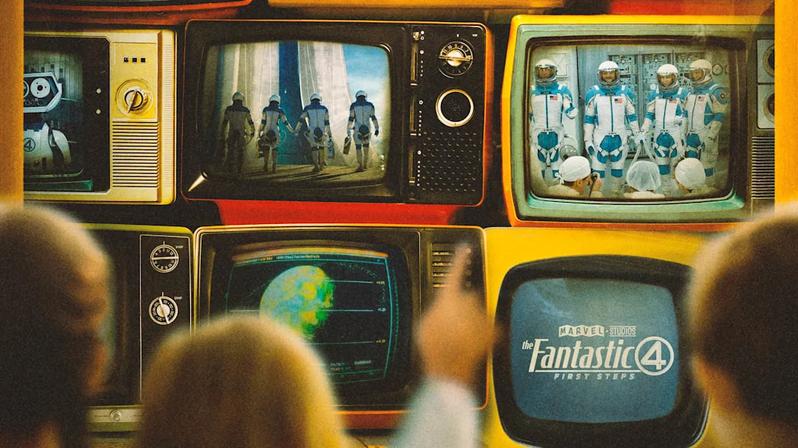

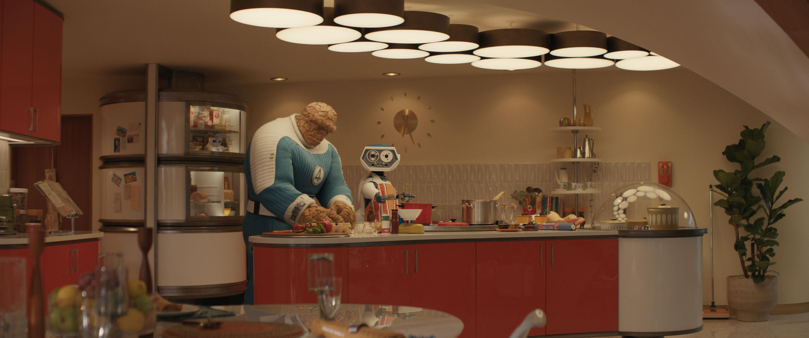

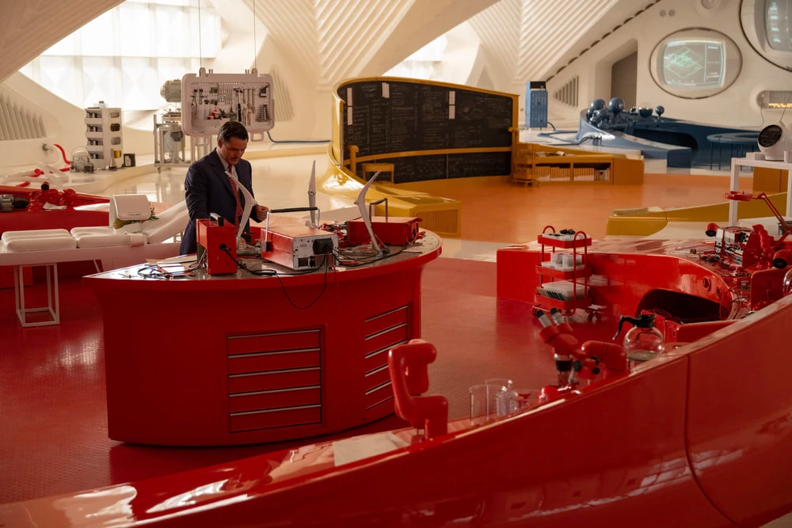

<small class="block text-center"> The Fantastic Four: First Step </small>

## Definition

Public records of the term "Retro-futurism" can be traced back to 1983 in a New York Times advertisement for Bloomingdale's jewelry, first using the adjective "retro-futuristic" to describe the "both old and new" texture of silver steel and gray tones. In 1987, Minnesota independent publisher Lloyd John Dunn officially renamed his experimental magazine "photoSTATIC" to "Retro-futurism," bringing the term into cultural view and it has been used ever since.

Wikipedia's definition of Retro-Futurism is:

> **Retro-Futurism** refers to the imitation of early Futurist design styles in contemporary art. This design style combines retro style with technologically colored futuristic style, usually reflecting early artists' conceptions of the future, like a parallel reality.

From the Chinese translation definition, the context and translation are not easy to understand. Retro-Futurism is essentially "the future in past people's eyes." It has two key elements:

1. **Past future imagination**: Refers to people's predictions and imaginations of the future world in past eras (mainly mid-20th century)
2. **Contemporary reinterpretation**: We now re-examine and reinterpret these old-era future imaginations with modern eyes

Simply put, it presents "the future in past people's eyes" — not our current predictions of the future, but looking back at past era people's imagined future world.

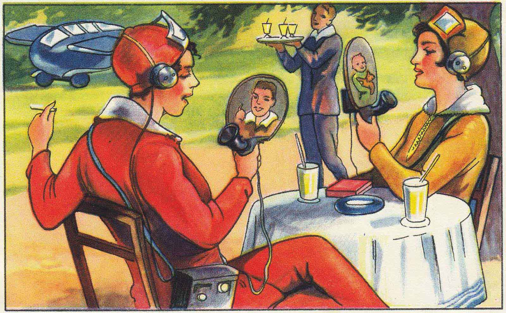

<small class="block text-center">In 1930, German illustrator Echte Wagner depicted fantasies of year 2000 future technology</small>

<small class="block text-center">The Art of Robert McCall - Artwork imagining future worlds</small>

## Retro-Futuristic Design Style Characteristics

Let's focus our perspective on the design field. The characteristic of Retro-Futurism is using current perspectives to recall and rewrite "a certain past era's imagination of the future," reviving "unrealized old futures" in contemporary context, thereby forming a kind of temporal dislocation aesthetic tension and critical nostalgia. The style is not fixed either, but based on a past era fragment plus constantly changing "future" constituting the concept of Retro-Futurism.

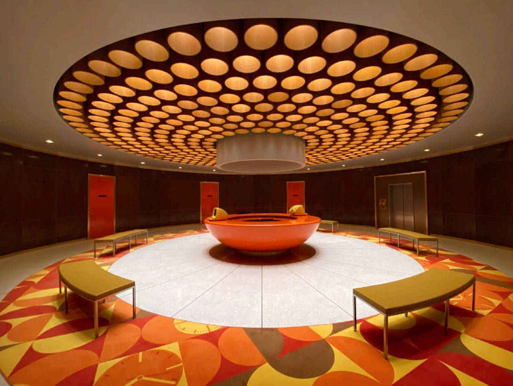

<small class="block text-center">Loki set design heavily referenced classic mid-20th century modernist architecture</small>

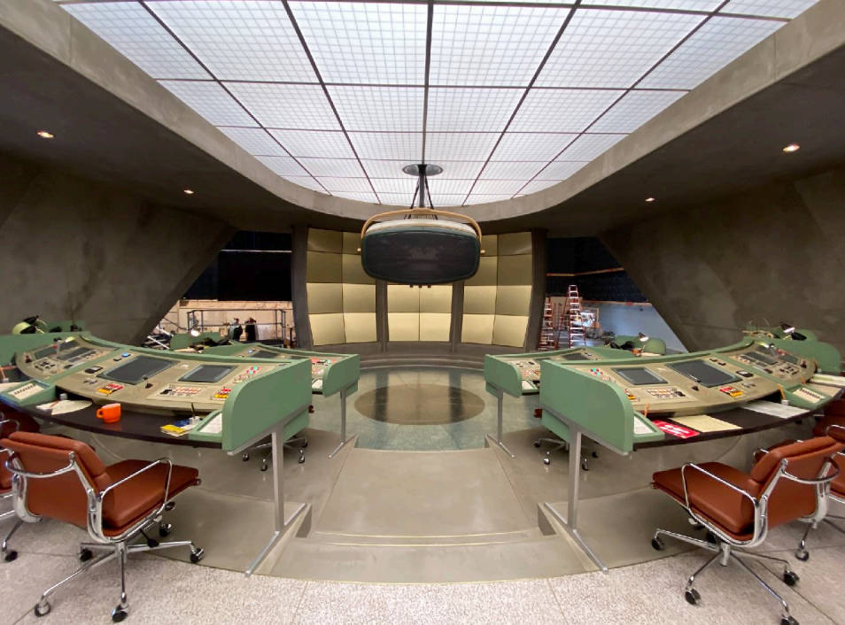

<small class="block text-center">Loki Time Variance Authority control room</small>

### Visual Language

Retro-Futurism's visual language is full of drama and imagination.

- **Streamlined Design**

Iconic streamlined design inherits the aesthetic tradition of the 1950s-60s "Space Age," characterized by smooth, rounded curves and dynamic aerodynamic shapes. This design language is not only embodied in architecture and transportation, but also permeates daily product design, giving them a sense of transcending the era's futurism.

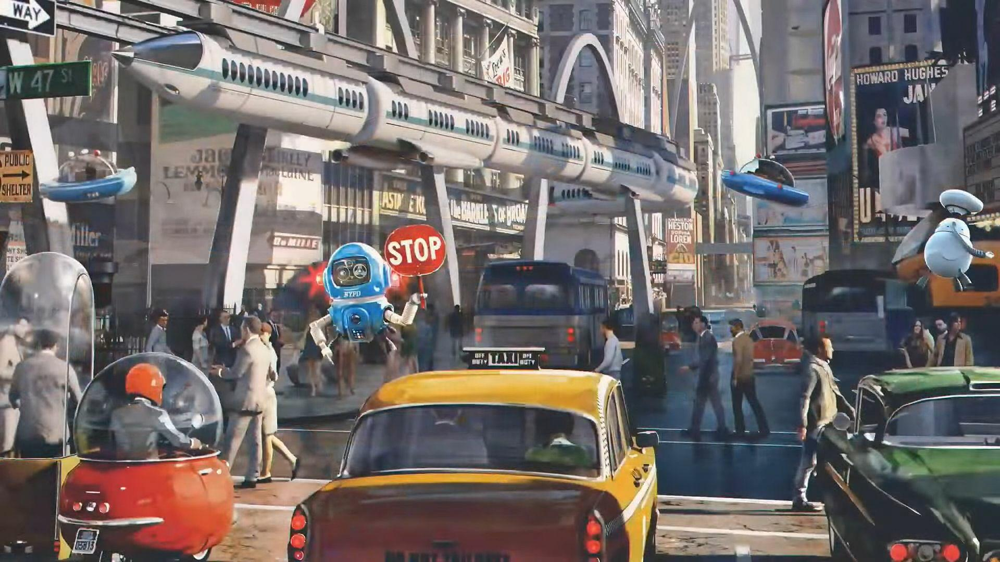

<small class="block text-center">The Fantastic Four: First Step screenshot</small>

- **Bold Color Combinations**

In color combinations, Retro-Futurism is bolder and more flamboyant. Vivid contrasting tone combinations create strong visual impact. These colors blend nostalgic retro and advanced future characteristics, cleverly expressing contradictory emotional feelings.

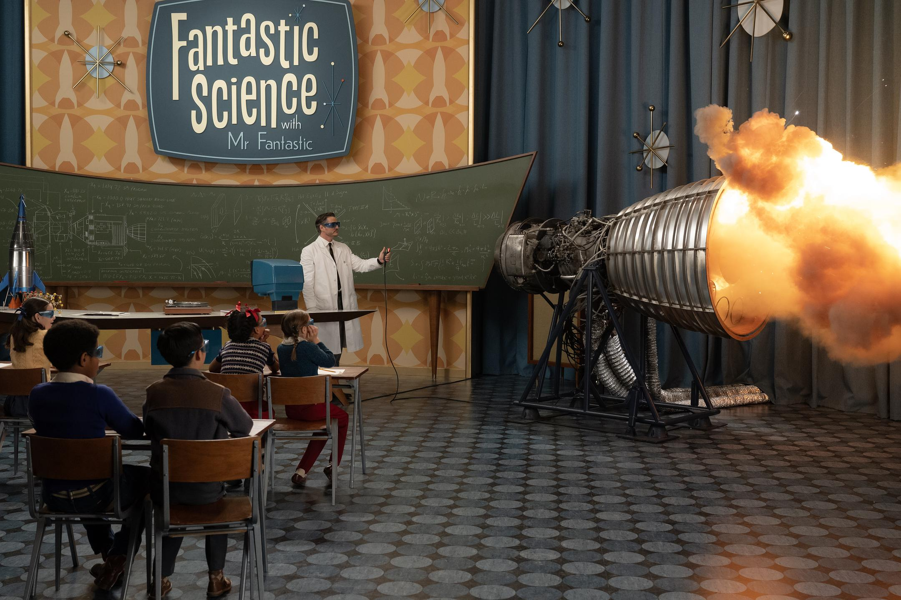

- **Geometric Shapes and Metallic Textures**

Geometric shapes are also common elements - starburst patterns, atomic symbols, concentric circles, and angular geometric shapes constitute Retro-Futurism's visual vocabulary. The widespread use of metallic textures (like chrome alloys, polished metals, and reflective surfaces) further highlights this futuristic sense. Especially for last century's thought trends, such visuals seemed to represent a technologically more advanced future.

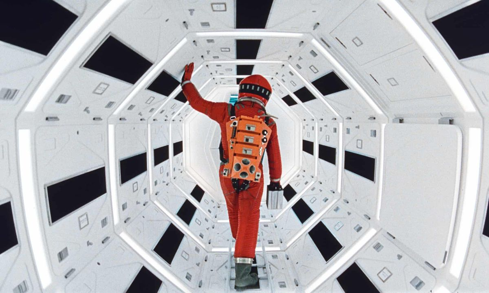

<small class="block text-center">2001: A Space Odyssey</small>

- **Future Technology Elements**

Of course, imagination of future technology is indispensable. Flying cars, space stations, robots, aircraft and other sci-fi elements are regulars in Retro-Futurism works. They are past era's beautiful aspirations for the future, now reinterpreted, becoming unique visual symbols.

<small class="block text-center"> Robert McCalll, 1970s imagination of future world </small>

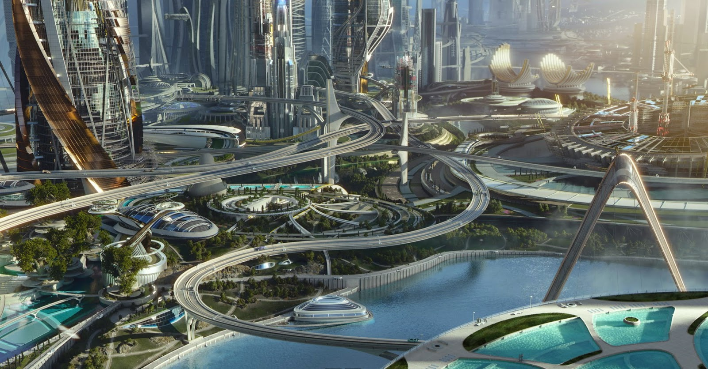

<small class="block text-center"> Tomorrowland (2015) 1960s optimistic imagination of future cities</small>

## Deep Logic of Design Principles

Let's go further and explore Retro-Futurism's inner design principles. Most core is temporal mashup: deliberately mixing design languages of different eras, such as juxtaposing 1950s home aesthetics with future technology elements, creating a wonderful time-space disorientation effect from color and structure design. This mashup isn't random assembly, but carefully designed dialogue, letting past and future meet in the same space.

Technological optimism is another important characteristic of this style. Unlike dystopian perspectives common in contemporary tech narratives, Retro-Futurism retains that pure enthusiasm for technological progress and longing for a better future found in early sci-fi works. This optimistic attitude is especially precious in today's tech-anxious era, even nostalgic and longed for.

In expression methods, Retro-Futurism favors exaggeration and drama, not overly pursuing pragmatism, but emphasizing visual impact and emotional experience. This makes Retro-Futurism works often have a surreal texture - they're not for solving practical problems, but for stimulating imagination and emotional resonance.

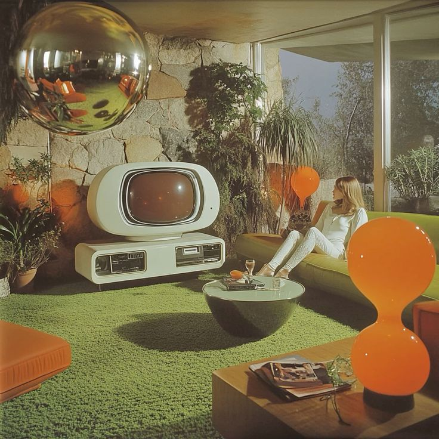

<small class="block text-center;"> AI imagination of retro-futuristic aesthetics </small>

<small class="block text-center">The Fantastic Four: First Step city background</small>

We can abstract as:

1. **Temporal Mashup**: Deliberately mixing design languages of different eras, like 1950s aesthetics with future technology
2. **Technological Optimism**: Expressing optimistic attitudes toward technological progress and aspirations for a better future
3. **Exaggeration and Drama**: Not pursuing pragmatism, but emphasizing visual impact and emotional experience
4. **Nostalgia and Innovation Coexist**: Simultaneously evoking nostalgic emotions and futuristic sense

## Work Characteristics

Retro-Futurism works often present rich multi-dimensional qualities. First is that unique "temporal dislocation." When facing a Retro-Futurism work, we often experience a strange temporal paradox, simultaneously feeling past and future existence. This dislocation isn't chaos, but conscious artistic treatment, challenging our traditional cognition of time's linear development.

Secondly, in Retro-Futurism's world, technology isn't cold tools, but existence closely integrated with human emotional needs. This fusion embodies an idealistic technological view - technology should serve human happiness and creativity, not the reverse.

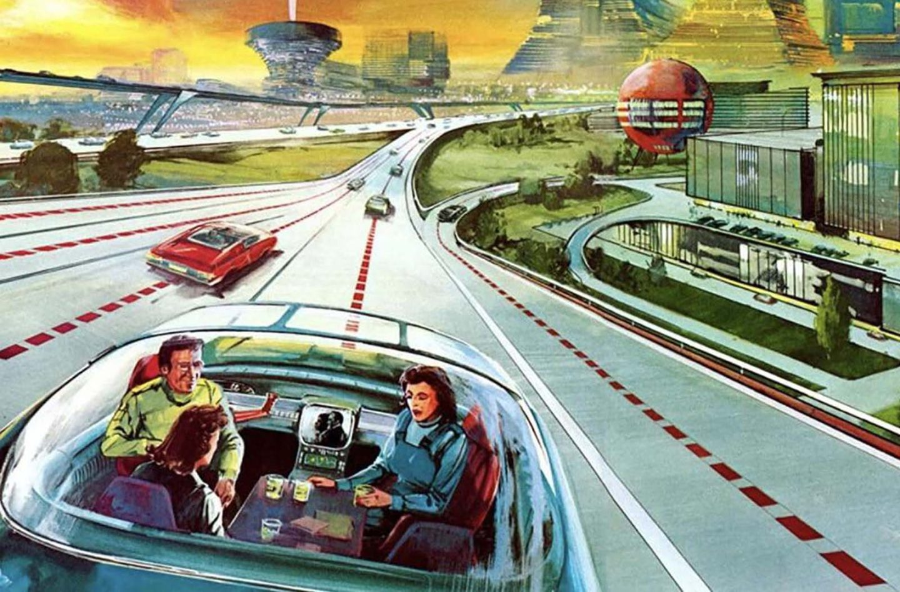

<small class="block text-center"> Last century's fantasy illustration of the future</small>

Parallel reality narrative is Retro-Futurism's core charm. These works create "could have happened but didn't happen" historical branches. The concept of parallel realities isn't unfamiliar in today's flourishing film and literary works, but the vitality displayed in the design field is delightful.

Era traces in details are Retro-Futurism's subtle points. Standing at present imagining future, these works also can't completely escape their creation era's aesthetic preferences and cultural backgrounds. These subtle era imprints precisely become Retro-Futurism's charm - they carry each era's cultural characteristics and unique imagination of the imagined future.

Simply summarized as:

1. **Temporal Dislocation Sense**: Works often present a strange temporal paradox, letting viewers simultaneously feel past and future
2. **Integration of Technology and Humanities**: Balance of technological elements and human emotional needs
3. **Parallel Reality Narrative**: Creating "could have happened but didn't happen" historical branches
4. **Era Traces in Details**: Even depicting the future, can see creation era's aesthetic preferences in details

## Development and Derivative Styles

Retro-Futurism is not an unchanging style. As times develop, people continuously resample, collage, and tempo-shift "past imaginations of the future." According to different era anchor points, emotional orientations, and technological settings, rich diverse branch styles have derived. Like Cyberpunk, Steampunk, Spacepunk / NASA Punk, and Vaporwave, Synthwave, Chillwave, Future Funk, etc. This "temporal dislocation" creation is fascinating.

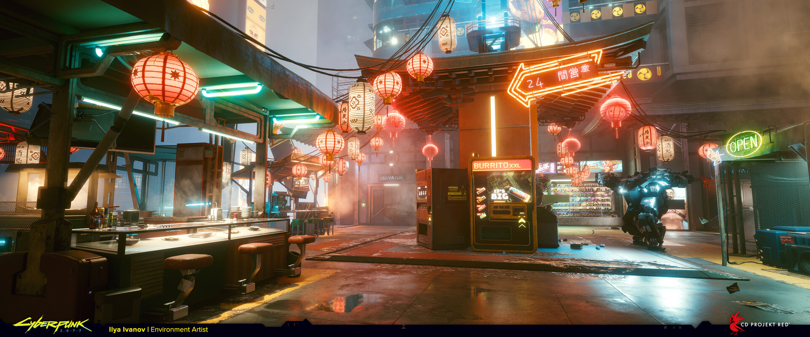

<small class="block text-center"> Cyberpunk 2077</small>

These branches each have their focus. Steampunk, Dieselpunk, Spacepunk are responsible for "returning to the past, rewriting the future." Cyberpunk is responsible for "freezing the old future, letting it continue rotting or shining today." Vaporwave/Synthwave are responsible for "cutting up old future commercials, making today's emotional background." They collectively constitute Retro-Futurism's "family tree." As new "present" continuously becomes "past," tree branches are still growing.

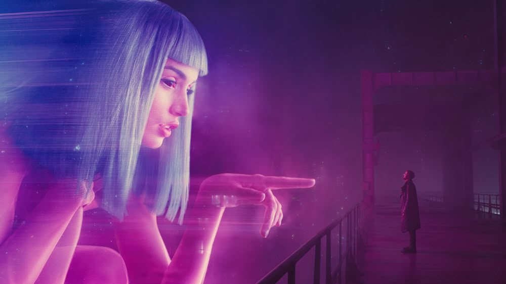

<small class="block text-center"> Blade Runner 2049</small>

Of course, we'll explore these styles in detail later. Looking forward to it.

## Finally

In my personal understanding, Retro-Futurism design style is essentially a clever temporal paradox, fusing two completely different elements: certain past and unknown future.

Past historical elements represent certainty and security. These familiar visual symbols, aesthetic styles, and cultural memories provide a cognitive anchor for viewers. We can subconsciously recognize last century's cultural characteristics and retro elements existing in scenes. They evoke nostalgic emotions, giving us comfort and intimacy.

Future elements symbolize the unknown, possibilities, and exploration. The future itself is full of uncertainty, potentially exciting or unsettling. It challenges our imagination, pushing us to think about "what might be" questions.

Retro-Futurism's unique charm precisely comes from this contradictory harmonious unity: it uses familiar past language to describe the unknown future, thereby creating emotional balance. Familiar retro elements reduce anxiety about future uncertainty, while future imagination injects fresh vitality into nostalgic sentiment, preventing it from degenerating into simple imitation or copying.

This temporal interlacing produces fascinating visual and cognitive experiences, satisfying our psychological needs for security and familiarity while triggering curiosity and exploration desire for unknown worlds. I believe in today's era of increasing uncertainty, Retro-Futurism will become increasingly popular because it provides a way to face the future, not just limited to design style.

## Reference Articles

- 宅在缸中的脑斯基 - [Talking about Retro-Futurism! The Universe Once Lifted Its Skirt for Humanity Last Century](https://zhuanlan.zhihu.com/p/874642642) (Good article! Recommended)

- 余月鱼鸽 - [Retro-Futurism: Can Applied Science Fulfill Its Early Promises?](https://zhuanlan.zhihu.com/p/699505638)

- 暴君7200 - [Time Is Circular: Sorting Out "Retro-Futurism"](https://www.gcores.com/articles/116899)

- Sparkwarrgon - [How Did Loki's TVA Time Management Bureau Make Retro-Futurism So Complete?](https://zhuanlan.zhihu.com/p/388058034)
