Although I'm a designer, I've always felt that drawing icons is quite troublesome - they need to be standardized, concise, precisely express meaning, have design sense, and also meet massive quantity demands. Especially for time-pressed projects, icon production is a tedious and energy-consuming task.

Fortunately, open-source contributors upholding internet open-source culture have contributed many excellent open-source projects, allowing us to directly use these quality results. Below I'll share 14 quality icon libraries from my daily collection, basically covering all icon types, each with different advantages - like supporting React, Vue, Svelte and other common development frameworks, freely adjustable lines, colors, sizes and other details, providing Figma source files and various other needs.

In my personal experience, they completely meet my commercial and personal project needs. Below are specific icon library introductions:

### 1. Free Svg Icons

- URL: [freesvgicons.com](https://freesvgicons.com/)
- Description: Aggregates multiple common open-source icon libraries, integrating over 250K icons, supports SVG, PNG, React, Ts and other format exports, basically covers all scenario needs.
- Advantages: Aggregation platform, preview and compare multi-platform icons at once, convenient for cross-border use, can directly download and edit, no complex authorization process needed.

    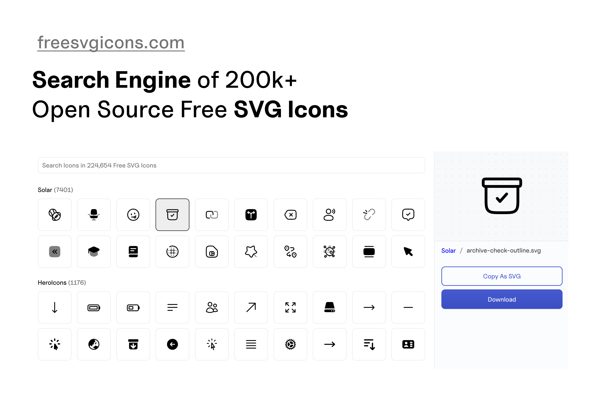

### 2. Iconsax

- URL: [https://app.iconsax.io/](https://app.iconsax.io/)
- Description: Multi-style variant (Outline / Bold / Bulk / Two-tone / Broken etc.) modern icon system. Total 40K+ icons, over 6000 free icons.
- Advantages: Supports React, Vue, Svelte frameworks, customizable size, color and stroke, high style consistency, benefits medium-large design systems, high integration efficiency.

    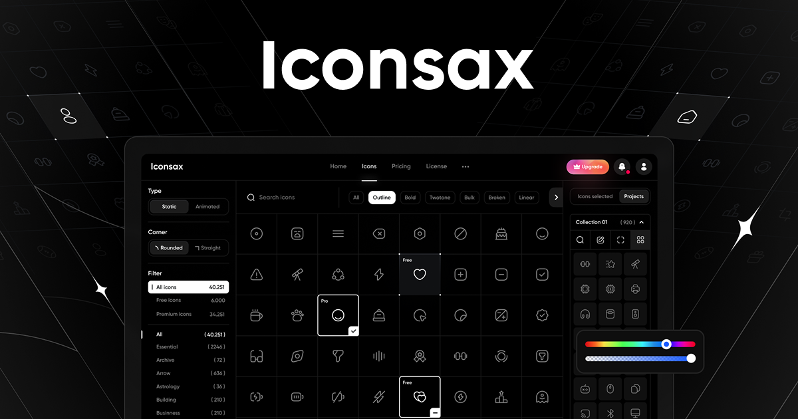

### 3. Mageicons

- URL: [https://mageicons.com/](https://mageicons.com/)
- Description: Open-source minimalist modern style icon library, includes nearly 1000+ icons, supports Figma, React and Web Fonts.
- Advantages: Clean beautiful design, supports Stroke Icons, Fill Icons, Brand Icons.

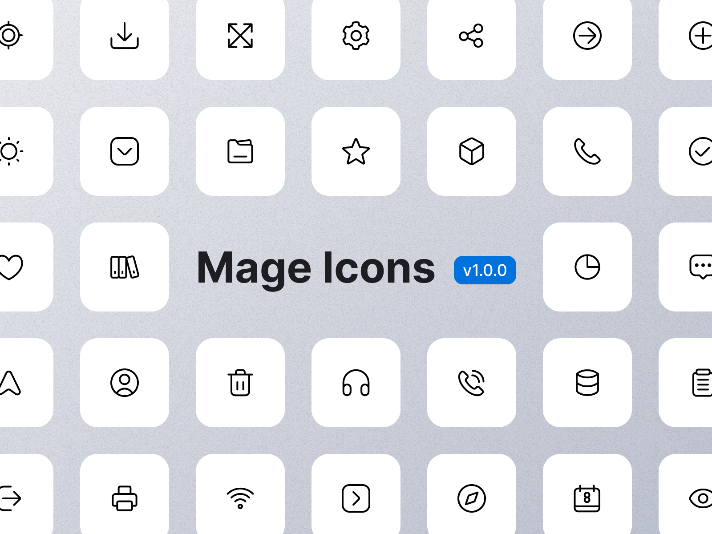

### 4. Remix Icon

- URL: [https://remixicon.com/](https://remixicon.com/)
- Description: Well-known open-source icon library, has over 3000 icons, covers common product, development, commercial scenarios. Neutral versatile style, provides Figma community file, one-click import usage.
- Advantages: Icon line consistency and standardization, adapts to Web, mobile multi-scenario, high update frequency, supports mainstream development frameworks, active community maintenance.

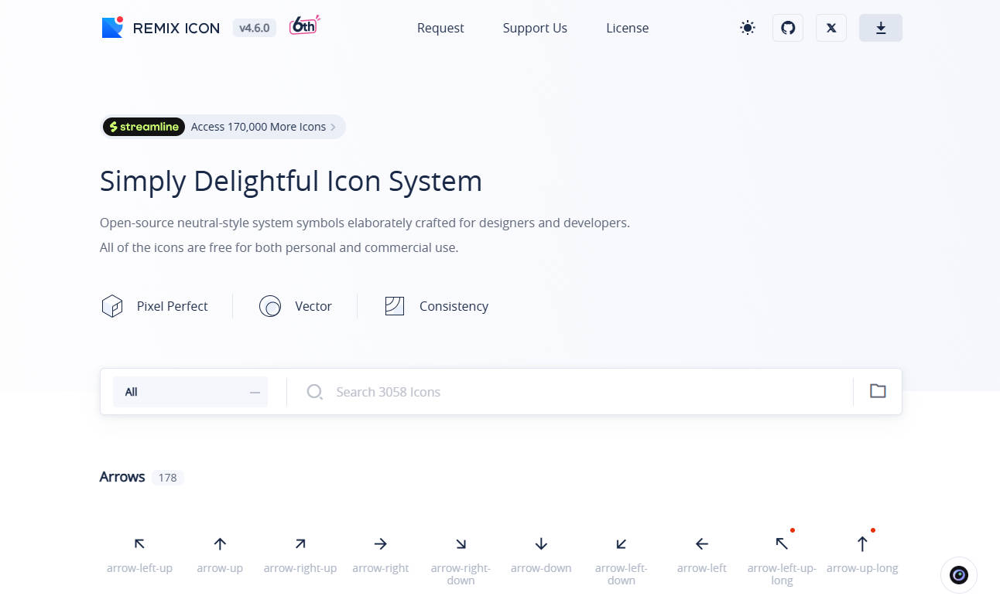

### 5. Lucide

- URL: [https://lucide.dev/](https://lucide.dev/)
- Description: Lightweight open-source linear icon library, includes over 1600 icons, with minimalist design language adapts to various interfaces, one of my most commonly used icon libraries, recommended.
- Advantages: Small size efficient loading, supports custom stroke width and color, compatible with React, Vue frameworks, suitable for projects pursuing lightweight.

### 6. Akar Icons

- URL: [https://akaricons.com/](https://akaricons.com/)
- Description: Open-source minimalist style icon library, contains over 400 icons, friendly linear icon library with soft rounded end treatment.
- Advantages: No redundant code easy integration, icon design concise and friendly, suitable for minimalist interface design.

### 7. QingIcon

- URL: [https://qingicon.com/](https://qingicon.com/)
- Description: Domestic designer project, designed and developed by Asorn & 胡蝶, over 2000 icons, single and dual color styles, diverse types, suitable for B-end, middle and back office projects.
- Advantages: Supports SVG, Figma plugin, Wenfont, has detailed guidance documentation, also has an SVG illustration library, meets personalized design needs, recommended!

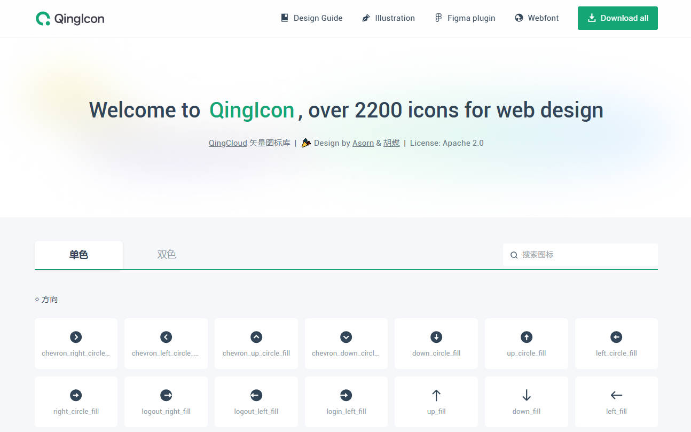

### **8. Circumicons**

- URL: [https://circumicons.com/](https://circumicons.com/)
- Description: 285 free icons, icon library with circular/rounded outline as overall visual carrier.
- Advantages: Unified style high recognition, excellent design, supports size and color customization.

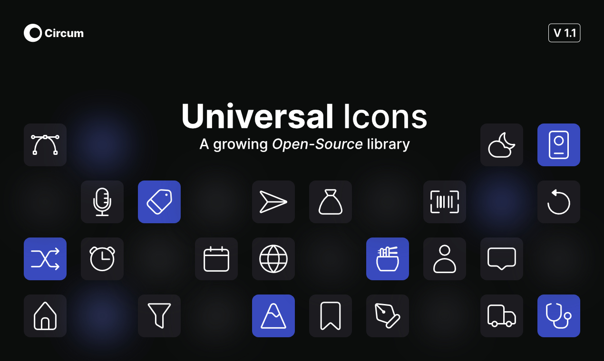

### **9. Hero Icons**

- URL: [https://heroicons.com/](https://heroicons.com/)
- Description: Open-source icon library developed by Tailwind CSS team, contains over 300 icons, divided into outline, solid, Mini, Micro four styles, provides Figma community file.
- Advantages: Seamless adaptation with Tailwind CSS, icon style simple and unified, supports React, Vue framework component calls, high development integration efficiency.

### 10. Boxicons

- URL: [https://boxicons.com/](https://boxicons.com/)
- Description: Over 3000 free icons, contains Basic / Duotone / Brands categories.
- Advantages: Supports multiple customization methods, including custom size, color, lines, etc., convenient integration.

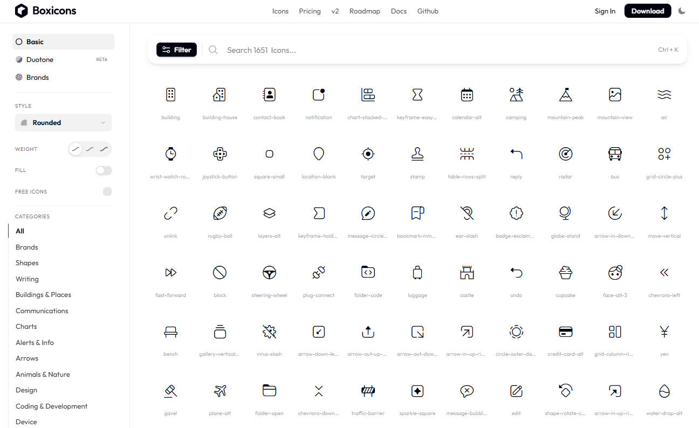

### 11. Grassicons

- URL: [https://grassicons.framer.website/](https://grassicons.framer.website/)
- Description: 100+ linear style, clean design, supports SVG and Figma.
- Advantages: Contains static and dynamic icons, icon animations concise and smooth.

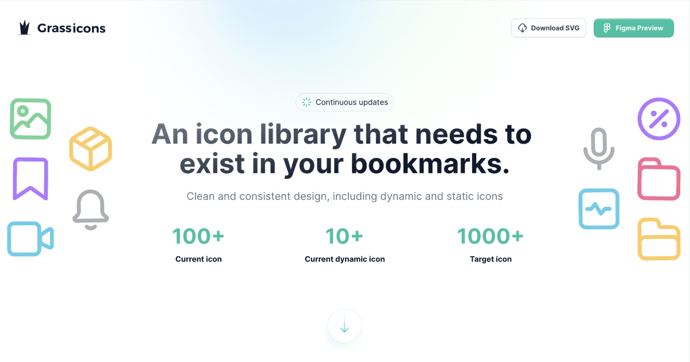

### 12. Isocons

- URL: [https://www.isocons.app/](https://www.isocons.app/)
- Description: Isometric style 3D perspective light skeuomorphic icons.
- Advantages: Has three-dimensional depth, enhances information entry attraction, suitable for feature promotion / landing pages / empty page illustration.

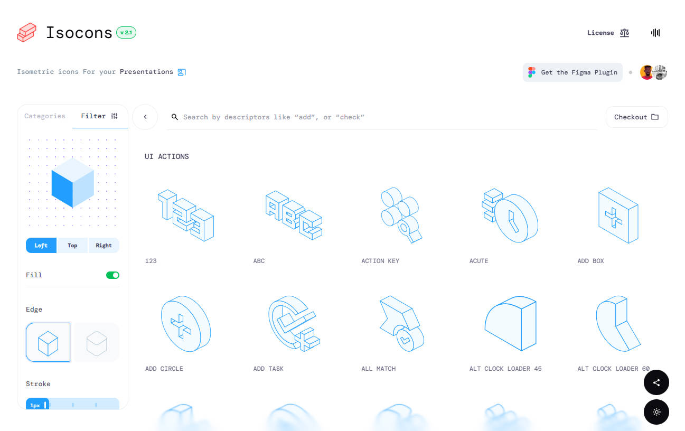

### 13. Iconoir.com

- URL: [https://iconoir.com/](https://iconoir.com/)
- Description: Includes over 1600 icons, semantic coverage very comprehensive.
- Advantages: Framework (React / Vue / Flutter etc.) support, customizable size, stroke and color.

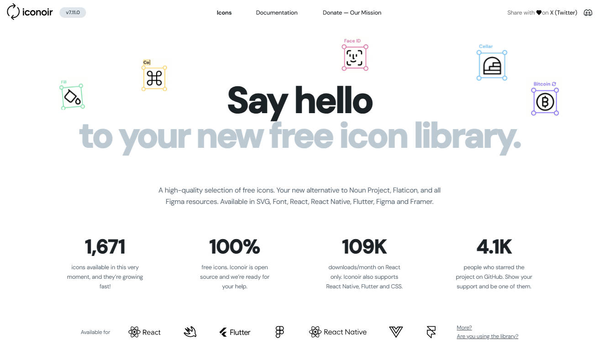

### 14. Doodle Icons

- URL: [https://khushmeen.com/icons.html](https://khushmeen.com/icons.html)
- Description: Hand-drawn style icon library, includes over 400 icons and an illustration library, lines lively and agile, full of creative sense.
- Advantages: Unique style different from regular icons, suitable for personalized, youthful design scenarios, supports PNG, Figma, SVG.

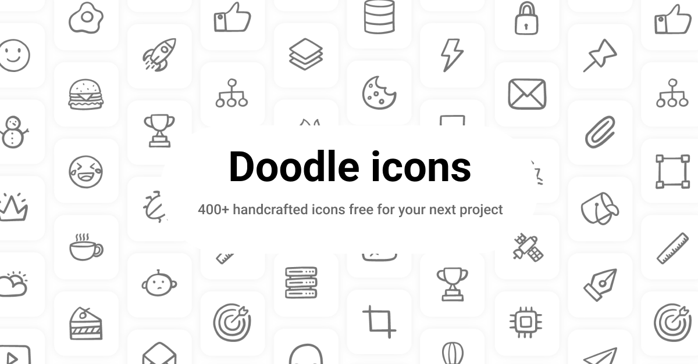

### Finally

Good use of excellent open-source icon libraries can let you invest energy into interface information architecture, visual rhythm and interaction strategy that truly have differentiated value.

I've also collected all the above icon libraries into my own resource integration website UIUXDECK. If you find it too troublesome to bookmark one by one, you can check out all my resource collections here.

URL: <a href="https://uiuxdeck.com/search?category=icon-library" target="_blank"> uiuxdeck.com/search?category=icon-library </a>

<a href="https://uiuxdeck.com/search?category=icon-library" target="_blank">
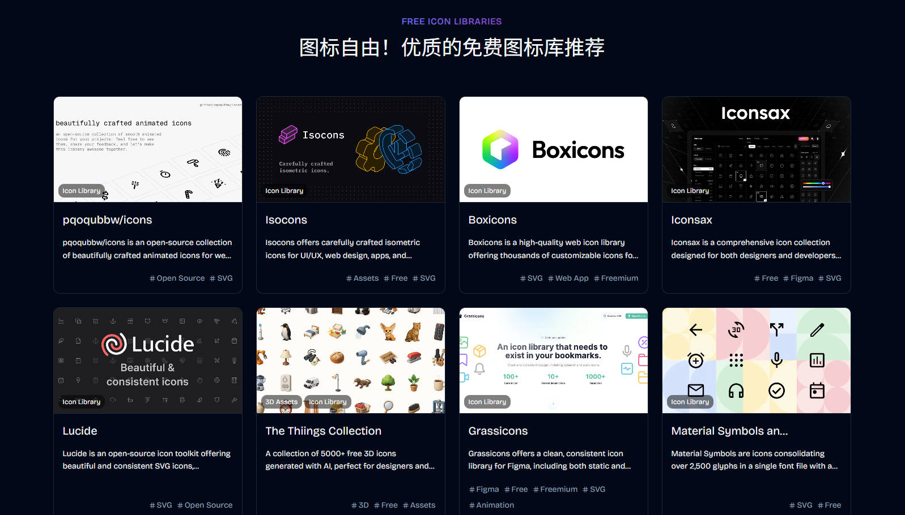
</a>

I'm Rico, thanks for reading!
