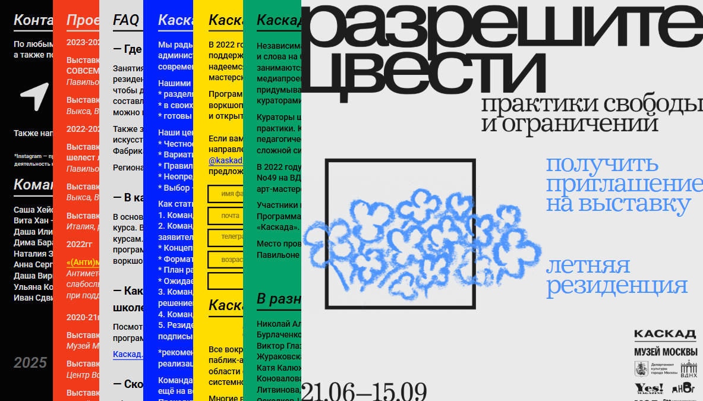
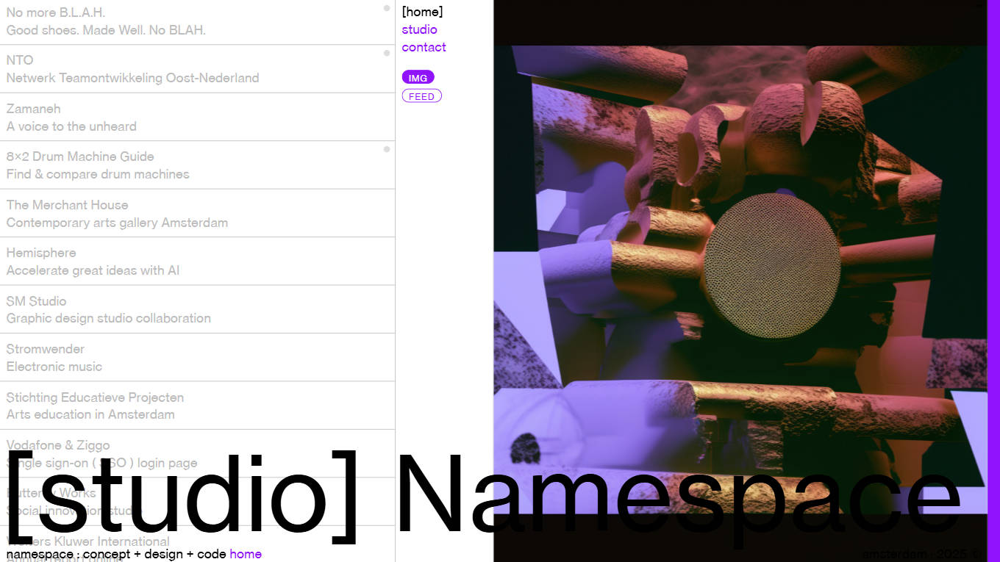
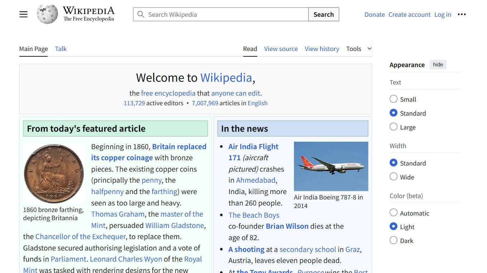
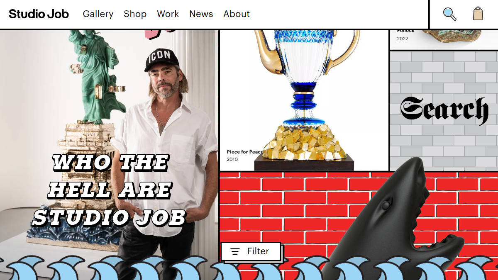
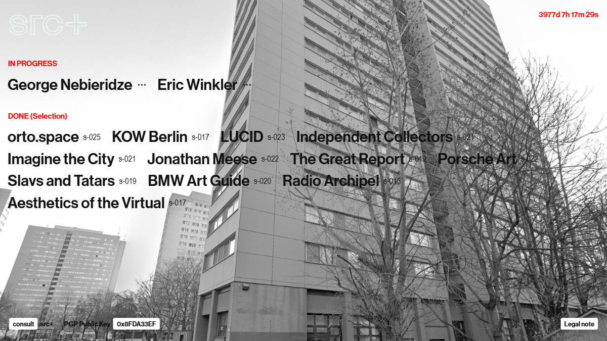
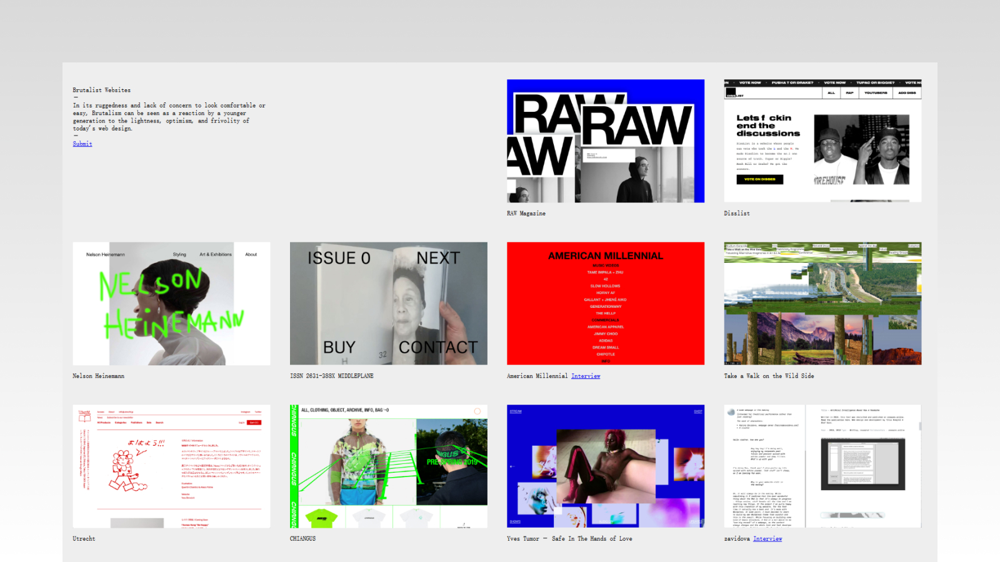
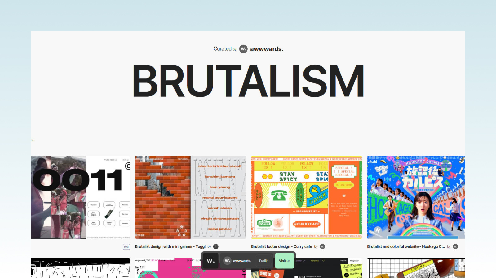

## What is Brutalism in Web Design?

> Brutalism  US: ['bru:təlɪzəm]  UK: ['bru:təlɪzəm]  Brutalism; Raw style; Minimalist rugged style
>
> * Brutalism: A design style originating from the architectural field, emphasizing raw, rough, and anti-traditional aesthetics, focusing on functionality rather than decoration, often using bold typography, asymmetric layouts, and strong contrasting colors.

The term "Brutalism" originates from the French term "béton brut," meaning "raw concrete." Initially, it was used to describe a rugged, exposed architectural style that emerged in the late 1940s and early 1950s. An architectural style that emerged in Britain in the 1950s, characterized by exposed concrete and stark geometric structures, spreading globally between the 1960s and 1970s.

*Tribunal de Contas / Aflalo y Gasperini São Paulo, 1971*

Brutalism is a raw, minimalist design style that values function over form and aesthetics. It's often characterized by an extremely simple, almost minimalist approach to layout and UI design. It's a bold, counter-intuitive interpretation of raw, striking visual design — and difficult to define with a definition, because it's essentially designed to challenge definition.

Like most emerging trends, Brutalism is a reaction to previous styles: a desire to discard earlier complex, ineffable ornate designs.

*Banco de Londres y Sudamérica / Clorindo Testa Buenos Aires, 1966*

## Why Did Brutalism Rise in Web Design?

Early web iterations all focused on raw functionality and content: crudely coded HTML websites and bold 90s design themes conceptually naturally resembled architecture's rugged, exposed structure defining characteristics. This itself was a practical issue. As times developed, web pages gradually became what we see today (the vast majority) — reasonably laid out, following user experience, emphasizing aesthetics and color theory, etc. Thought, culture, aesthetics, and needs are diverse, as are pursuits for web pages. Mainstream web pages pursue advanced beauty and perfect experience, which also provided soil for Brutalism's development.

Some people believe that mainstream web pages' advanced aesthetics and experience create a beautiful illusion, making people subconsciously ignore potentially unethical and malicious real intentions hidden behind web pages. The popularity of Brutalist web design perhaps also reflects people's hope that the internet can be more transparent and direct. People hope that websites' underlying logic and real intentions can be as clear at a glance as Brutalist architecture displays its raw materials and social philosophy.

## Characteristics of Brutalist Web Design

### Unconventional Color Schemes

Brutalism in the architectural field often uses large amounts of gray, black, brown and other cold-toned color schemes. Web Brutalism is different, using more glaring, conflicting color combinations for design, going against mainstream web aesthetics and color theory.

"We don't need everything that meets our eyes to be perfect."

*https://kaskadproject.com/*

### Non-Standard Navigation and Information Hierarchy Design

Typically, UX/UI designers follow user experience principles and reasonable information hierarchy to reduce user cognitive load and improve website navigation convenience. Brutalism is the opposite, preferring to use non-standard navigation and rugged information display methods.

*https://namespace.studio/*

### Raw and Rough Design Philosophy

From layout and typography to color matching, Brutalist websites intentionally create a raw and unpolished environment. This can find inspiration and origins from mid-20th century architecture. Due to era background and atmosphere influence, architecture emphasized raw, rough appearance, presenting concrete's real texture without excessive embellishment.

Reminds people of the early internet's web page state without design layout and beautification, a design philosophy going against current mainstream web culture, abandoning beautification and decoration, displaying real and rough essence.

 
*https://en.wikipedia.org/wiki/Main_Page*

### Repetitive, Unique Shapes and Patterns

Brutalist style web design typically contains repetitive shapes or patterns, or unique two-dimensional, three-dimensional graphics, maintaining a unique visual experience. It often finds elements and inspiration from last century's Brutalist architecture, continuing and imitating Brutalist architecture's geometric characteristics philosophy.

*https://www.studio-job.com/*

### Visual Impact and Oppression

Brutalist period architecture's massive unadorned exposed concrete and stark geometric structures bring a raw beast-like sense of oppression. This visual experience also extends to Brutalist web design, and web applications are bolder and more free-spirited. Especially contrasted with mainstream culture pursuing delicate experience and beauty, Brutalist web pages appear more rebellious and alienated.

*https://src.plus/*

### Brutalist Style Website Inspiration

#### brutalistwebsites.com

brutalistwebsites.com - this website's content is as direct as its name, collecting Brutalist style web pages. Content is just a brief introduction and cases. "In its ruggedness and disregard for appearing comfortable or easy, Brutalism can be seen as the younger generation's rebellion against today's web design's lightness, optimism and frivolity."

*https://brutalistwebsites.com/*

#### awwwards-brutalism

Awwwards is a well-known web design inspiration and award platform. The collection specifically gathers Brutalist style web design works for designers to gain inspiration. This collection is more excellent in design sense and interactive animation aspects.

*https://awwwards.com/awwwards/collections/brutalism/*

## Summary

Brutalist web design doesn't mean abandoning design, but directly displaying the website's "skeleton" - like using the most basic typography, buttons and links, without excessive decoration. Doing this aims to let users see the website's structure and intent at a glance, reducing misleading and hiding, making everything "out in the open." Pulling attention back to content and functionality, making it easier for users to find information they need.

Brutalism's "roughness" is actually an attitude, conveying the website's unique temperament and rebellious spirit. It challenges mainstream aesthetics, not afraid to "look imperfect," instead using this "primitive sense" to express authenticity and self.

Design is a cycle. Brutalism from birth to today, like tides ebbing and flowing. Of course in each era it combines with that era's characteristics and cultural philosophy, blending out new design styles and thoughts.

For example, Neo-Brutalism, Postmodern Brutalism, Industrial Brutalism, Cyber Brutalism, etc., are all products of era pursuits and retro trends merging. These styles originate from Brutalism's raw power and functional core, but through combination with other aesthetics or functional needs, formed diversified derivative schools.
