I'm Rico. I've previously posted articles on multiple platforms about designers learning frontend, but quite a few people actually have some confusion or doubts, or suspect intentional anxiety creation. But I've always felt that career choices should vary by person - some delve deep into design purity, some like cross-border exploration possibilities, there's no absolute right or wrong. Current industry trends are indeed moving from "strict division of labor" to "collaborative integration," design boundaries are becoming more flexible and diverse.

As a relatively niche "cross-border explorer" among designers, having explored development for quite some time now, it's a good time for a stage summary. Sharing and reviewing some of my own non-commercial, non-collaborative personal projects as reference. These are basically built around my daily design needs and ideas. Some involving commercial types and collaborations won't be shown.

## 1. OG Inspiration Gallery - Rico OG

OG Website: [og.ricoui.com](https://og.ricoui.com)

This was recently developed on a whim when tired of writing, taking less than a week. It's an inspiration website focused on collecting OG (Open Graph) social sharing images. In one week I built a Beta version, half the time spent on visual specifications, basic function construction and technology stack selection.

Functionally supports favorites, color mode switching and category filtering, also includes detail page display, recommendations, etc. The website also features dark mode, multi-language switching and site submission functions. Due to short development time, current volume isn't large.

Future expansion features under consideration include search function, OG validation, expanding more types of inspiration libraries, OG editor, etc.

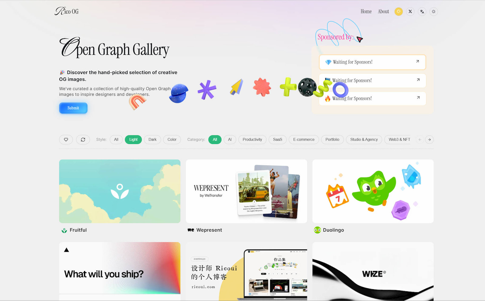

---

## 2. GradientsHub

One-stop gradient solution: [gradientshub.com](https://gradientshub.com/)

Gradientshub is a long-term project, currently updated irregularly. The goal is to create a one-stop tool site centered on gradient design. Current content includes original gradient backgrounds, AI-generated images, and text gradient, background gradient, gradient color card generation tool sets and teaching content, forming a complete gradient solution. Hope this website can assist designers and developers, solving problems that might be encountered in gradient design.

My original gradient backgrounds can be downloaded and used for free

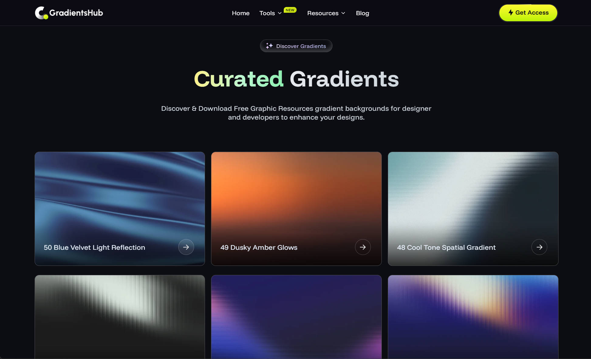

Gradient generation tool - CSS text gradient generator

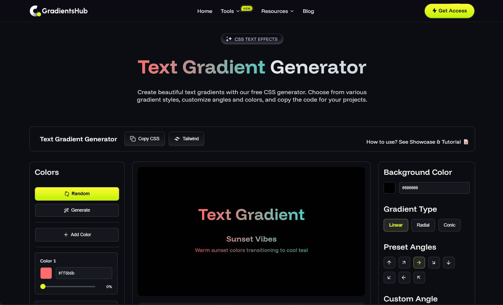

Gradient generation tool - CSS multi-color gradient generator

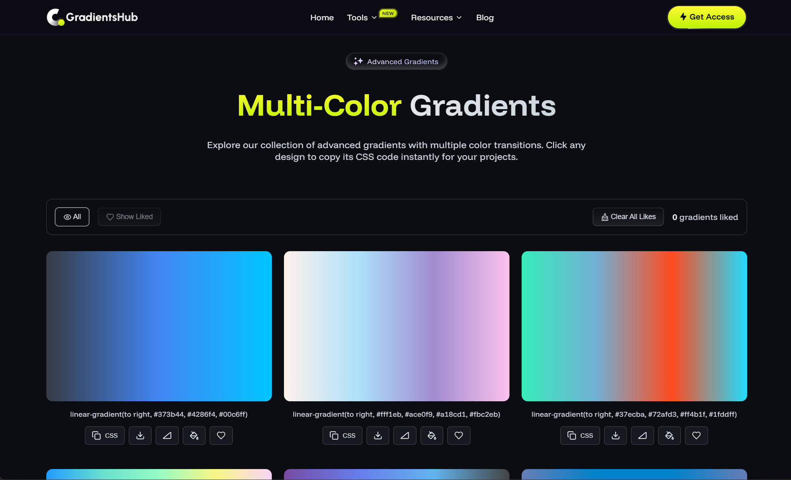

Gradient generation tool - Gradient color palette generation

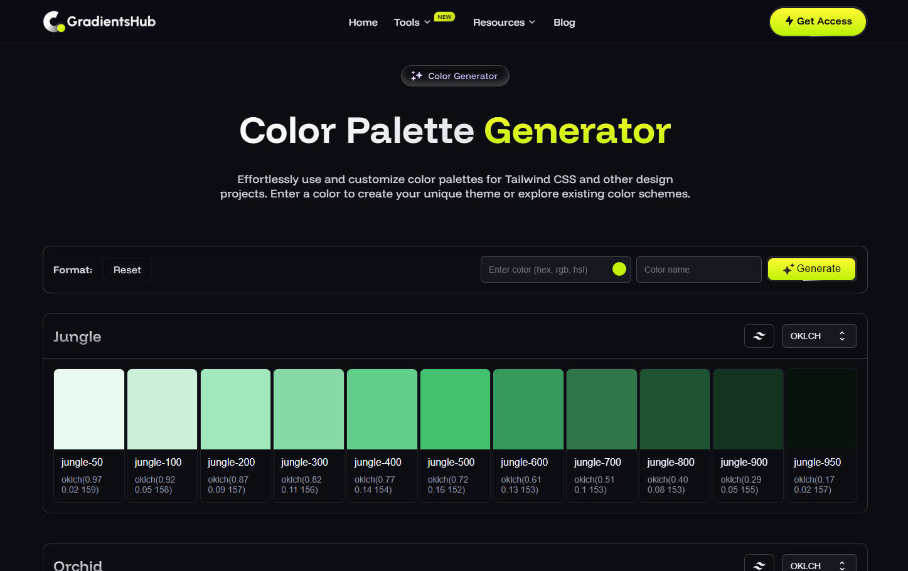

Besides what's shown above, there are other gradient tools and resources to explore. A purely sincere work~~

---

## 3. Web Inspiration InspoWeb

Website: [inspoweb.com](https://inspoweb.com)

Inspoweb.com is my web inspiration solution, currently manually collecting over 200 creative web pages. As a web designer, my daily habit is collecting excellent web design cases and visuals. I've tried many solutions, finally using the Mkdirs template to create this website, converting my daily collection needs into website curation, solving cross-device and location bookmark sync problems. Also convenient for focused categorization. More surprisingly, external sharing brought much positive feedback, letting me make more friends.

If your inspiration runs dry, might as well browse my collection here.

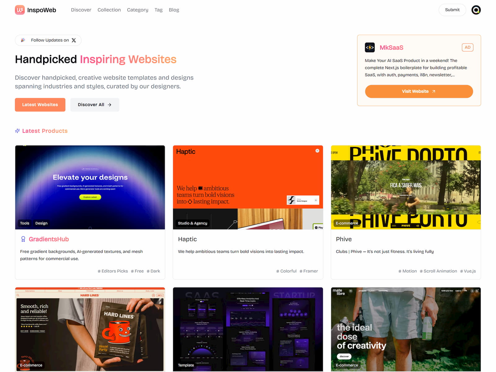

When curating, I tagged with categories and labels, along with corresponding interface screenshots for easy viewing.

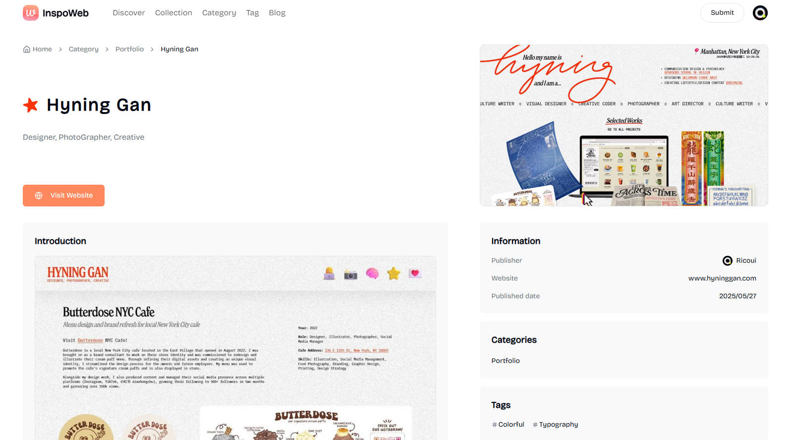

---

## 4. Design Resources UIUXDECK

Website: [uiuxdeck.com](https://uiuxdeck.com/)

UIUXDECK is a navigation website meeting my UI/UX design needs. I integrated interface inspiration, design specifications, practical tools and component libraries according to my own design needs and philosophy, even some development and marketing tools, hoping to help improve design professionalism and efficiency.

Whether you're a design novice or seasoned practitioner, I believe the content here can bring some inspiration and convenience to your work. Content personally reviewed and curated by me, ensuring practicality and timeliness, also using mkdirs.

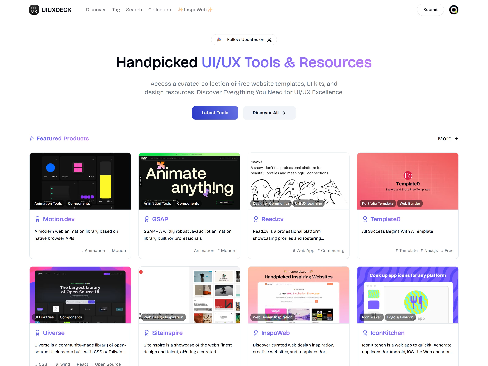

---

## 5. Designer Blog Ricoui

Website: [ricoui.com](https://ricoui.com/)

Open Source Star⭐ 198: [https://github.com/ricocc/public-portfolio-site](https://github.com/ricocc/public-portfolio-site)

A designer's personal website/blog is also an essential project. This website uses my preferred technology stack and design style. Design uses Figma + Blender, development framework chose the more designer-friendly Astro.js. Website template open-sourced to Github, Star count about to break 200.

Features include: homepage work filtering display, project display and inner pages, blog and article pages, personal page, dark mode, RSS, SEO optimization, etc. Supports markdown, also suitable for secondary development, built-in image compression function.

Disadvantage is no visual backend, requires deployment, manual file changes and content collection updates, not friendly to users without coding foundation.

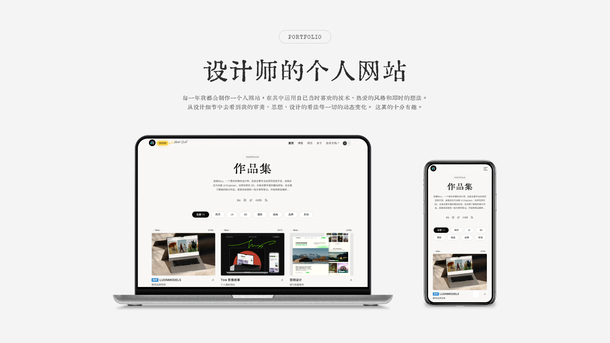

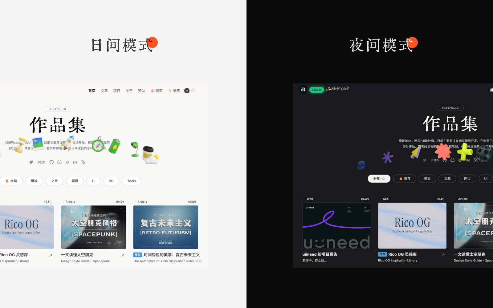

---

## 6. Web-based Todo List

Open Source Project Star⭐ 222: [GitHub - uiineed-todo-list](https://github.com/ricocc/uiineed-todo-list)

Website: [https://todo.uiineed.com/](https://todo.uiineed.com/)

This is a ready-to-use web-based TodoList, developed with Vue, simple and easy to use, can be downloaded for learning or custom development. Currently this simple single-page application is most popular. Since the starting point was not finding a "no-ads minimalist todo tool" meeting my needs, I just developed it myself. So requirements for it are basic, clean and simple, ready-to-use, minimalist visuals.

Advantage is can be directly downloaded for local offline use; disadvantage is doesn't support automatic data sync across devices and browsers.

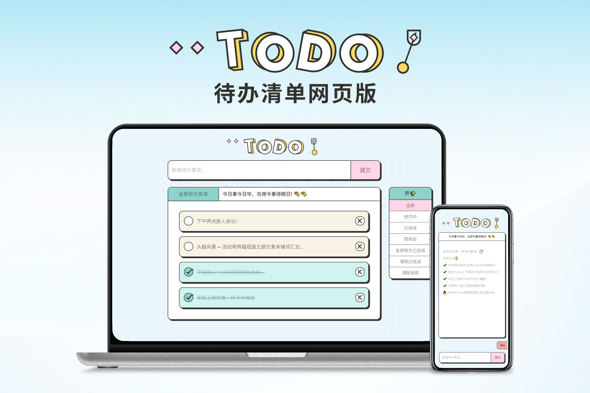

---

## 7. 3D Valentine's Day Icons and Landing Page

Figma: [https://www.figma.com/community/file/1363451172790940214/free-3d-icons-valentines-day](https://www.figma.com/community/file/1363451172790940214/free-3d-icons-valentines-day)

Landing Page: [valentine.uiuxdeck.com](https://valentine.uiuxdeck.com/)

Landing Page Open Source: [GitHub - free-3d-valentines-assets](https://github.com/ricocc/free-3d-valentines-assets)

This is an open-source Valentine's Day icon set. High-resolution image versions can be found in Figma community. I also made a landing page where you can download Blender source files.

- ✨ Two color sets of Blender source files
- ✨ Figma community files
- ✨ PNG high-resolution images 3000x3000

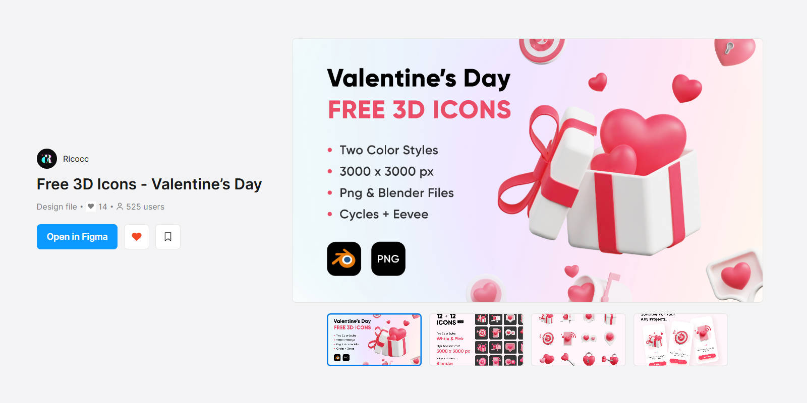

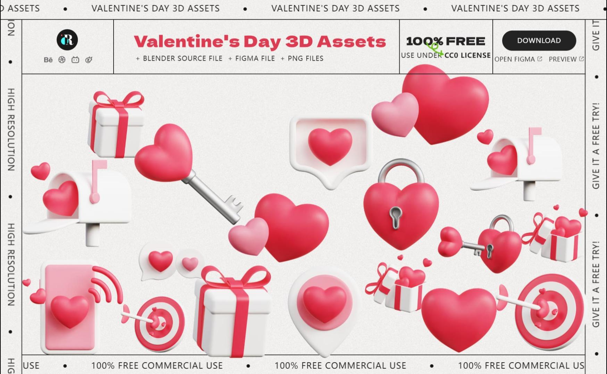

## Finally

The cases I've selected for display vary in type and difficulty: there's the complex comprehensive gradient site, application-oriented TodoList, navigation sites based on template secondary development, and single pages serving open source. Their purposes differ, development difficulty varies, but the ultimate starting point and goal are all to solve a specific need in my design work, replacing workflows I was originally unsatisfied with or found too complex. Even replacing originally paid applications.

So back to the starting point - what can design exploring development do? I think it's an omnipotent plugin. Whether in workflow or personal needs, when you feel you need some solutions, programming knowledge can provide another perspective. Especially in the AI Coding era, we don't need to learn complete programming principles, syntax or computer fundamentals from start to finish. Just first understand development thinking logic and basic tools, then use AI to get projects running - subsequent breakthroughs are just around the corner.

Essentially, development is like graphic design, 3D, video editing - just a skill. According to specific needs, learn what you need, use what you need, without much mystery.

For AI Coding, designers also have advantages. Visual and aesthetic leadership goes without saying. Let's mention two abilities designers take for granted: product thinking and componentization thought.

* Product Thinking

AI Coding (or Vibe Coding) brings users closer to product manager roles. Before starting a project, we need to first discuss product positioning with AI, formulate complete architecture, have AI output a detailed product document, then code based on documentation. For AI Coding, clear detailed product documentation can double efficiency. Product thinking is already an important part of designers' capability map. When combined, they can form a mutually reinforcing effect.

* Componentization Thought

Componentization and Tokens are old friends for designers in work. For development, it can be simply summarized as "everything is a component." One of frontend's core ideas is componentization. Whether React, Vue, Angular frameworks, or native development, all emphasize splitting pages into independent, reusable components (like header components, list item components, popup components, etc.). All complex projects can be split into module components, each component responsible for specific functions. This not only reduces development difficulty, but also precisely locates problems when errors occur. Completing complete projects gradually from components is a very efficient path. Worth mentioning is that componentization thinking isn't possessed by every developer - it's actually an important capability, and designers are already familiar with this logic in daily work.

Originally thought the previous "Frontend Self-Learning Suggestions" explained clearly enough, but still many designer friends raised questions, not knowing where to start, not knowing what to do, hence this supplement. From cases to supplementary explanations of viewpoints, these two pieces should answer most questions.

If you don't know where to enter the development world, might as well reference my above cases: cut in from your daily needs, find a specific problem, try using programming thinking to find solutions - interest is the best start. When the first minimum viable project successfully runs, naturally entering acceleration period afterward.

Currently I've entered the next stage of design and development, exploring more complete, more challenging projects, looking forward to producing better, more interesting works in the future.

Reintroducing myself - I'm Rico, web designer and interest-driven developer. Currently besides continuing to explore design and development, I'm also engaged in content creation, mainly focusing on design articles and AI Coding experience summaries.

If you're interested in these little things I'm doing, welcome to communicate and be friends!
